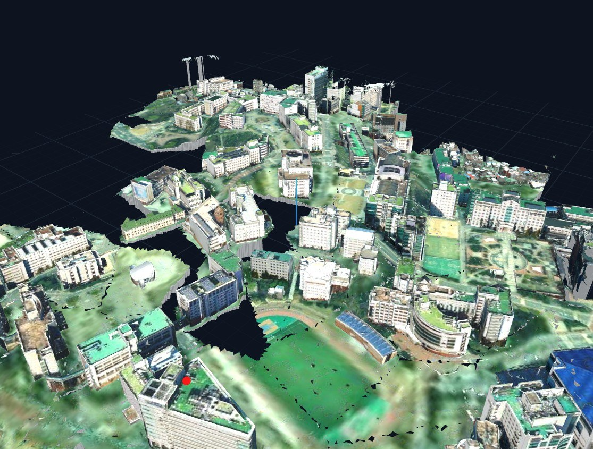
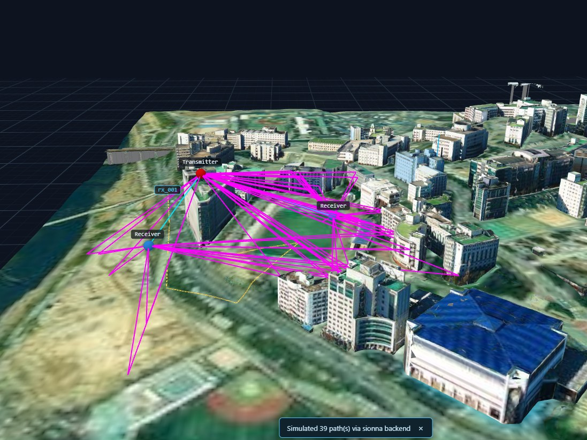
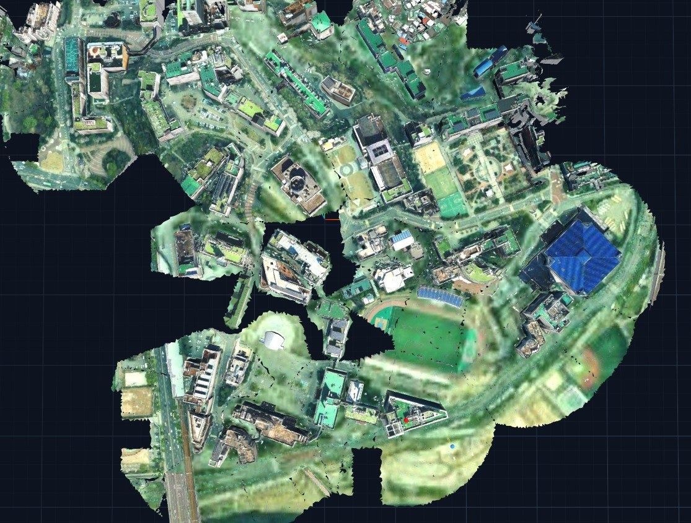
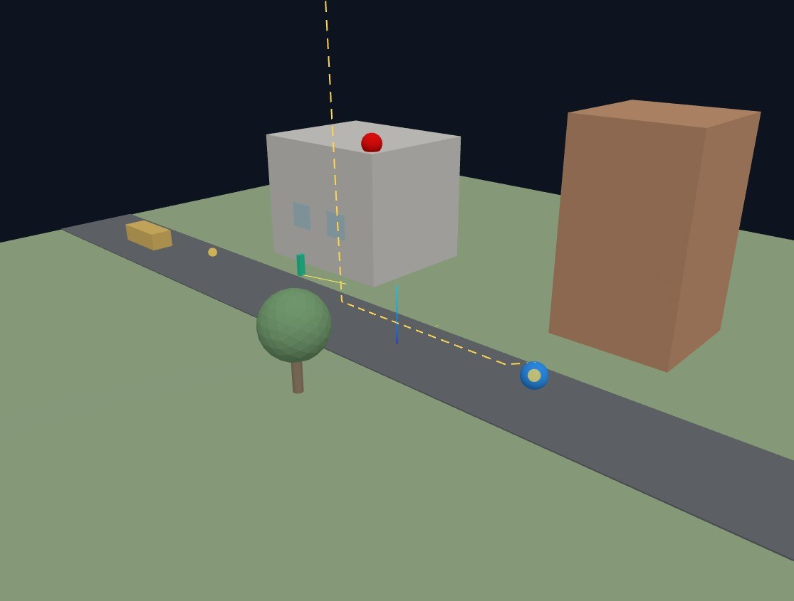
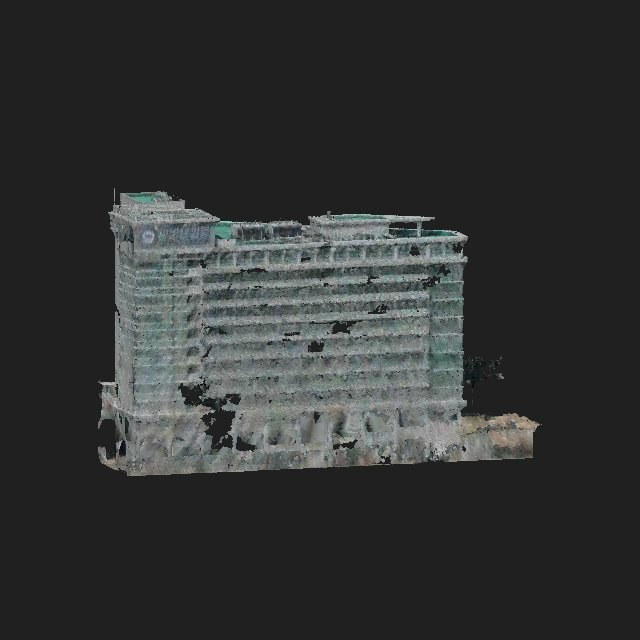

# SEAM Studio

**SEAM** — Scene-to-Electromagnetic Authoring and Mapping for Wireless Digital Twins

> 🇬🇧 **English README: [README.md](README.md)** · 🌐 소개 페이지: <https://jaewoo4200.github.io/SEAM/ko/>

**Sionna RT 기반의 로컬 우선 RF 디지털 트윈 워크벤치**입니다. 하나의 텍스처 3D
씬 안에서 모든 메시가 **두 개의 재질 바인딩**(렌더링용 visual/PBR + 전자기
시뮬레이션용 RF)을 함께 갖고, 캐노니컬 씬을 Sionna 호환 RF 프로젝션으로
컴파일한 뒤 레이 경로·라디오맵 결과를 다시 같은 뷰포트 위에 겹쳐 보여줍니다.

GPU, Sionna, LLM 어느 것도 **필수가 아닙니다** — 셋 모두 선택적 업그레이드이며,
**핵심 워크플로와 데모는 Mock 백엔드만으로 CPU에서 동작합니다(일부 기능은 Sionna 필요)**.

```text
Unified RF-Visual Scene Graph          (scene.seam.json - source of truth; legacy scene.sionnatwin.json)
  ├─ Visual Projection  →  GLB / textures / Three.js viewer
  └─ RF Projection      →  PLY material groups + Mitsuba XML → Sionna RT
```


*한양대 캠퍼스 트윈 — 드론/항공 텍스처 임포트를 연속 지형 위에, SEAM Studio 렌더.*

| | |
|---|---|
| <br>**Sionna RT 레이트레이싱** — TX 1기·RX 2기 사이 39개 경로(LOS 시안 · 반사 마젠타), 실제 Sionna 백엔드 솔브. | <br>**캠퍼스 트윈 정사 뷰** — 연속 지형 위 항공 텍스처, 뷰 스냅(1/3/7)과 무한 그리드. |
| <br>**Sample Demo** — TX/RX 배치와 지표고도(AGL) 편집, Mock 백엔드만으로 동작하는 튜토리얼 씬. | <br>**드론 매핑 FTC 건물** — SEAM-Agent가 추론에 쓰는 직교 멀티뷰 캡처. |

---

## Quickstart (3 commands)

> **사전 요구사항:** **Python 3.11/3.12**와 **Node.js 20+**가 PATH에 있어야 합니다
> (3.13+는 미검증). 그 외엔 아무것도 필요 없습니다 — 기본 **Mock 백엔드는 CPU만으로
> 동작**합니다. 실제 레이 트레이싱은 `sionna-rt` 패키지를 **별도 설치**해야 하고
> (`pip install -e "backend[sionna]"`), GPU·로컬 LLM은 그 위에 얹는 선택 업그레이드입니다.
> 전체 목록은 [INSTALL.md 사전 요구사항](INSTALL.md#사전-요구사항-prerequisites) 참조.

**Windows (PowerShell):**

```powershell
powershell -ExecutionPolicy Bypass -File scripts\install.ps1   # 1. 설치 + 데모 생성
powershell -ExecutionPolicy Bypass -File scripts\start.ps1     # 2. 백엔드+프론트 실행
# 3. 브라우저에서 http://localhost:5173 열기 (Sample Demo 자동 로드)
```

**Linux / macOS:**

```bash
bash scripts/install.sh   # 1. 설치 + 데모 생성
bash scripts/start.sh     # 2. 백엔드+프론트 실행
# 3. 브라우저에서 http://localhost:5173 열기 (Sample Demo 자동 로드)
```

수동 설치·엔진 옵션·문제 해결은 **[INSTALL.md](INSTALL.md)**, 첫 15분 실습은
**[TUTORIAL.md](TUTORIAL.md)** 를 보세요.

---

## RT GUI 대비 차별점

공식 NVlabs `sionna-rt-gui`(Polyscope 데스크톱 앱)는 씬을 로드하고 TX/RX를
배치·애니메이션하며 경로 + 래스터 라디오맵을 보여주지만, **메시 라디오맵·빔포밍·
재질 편집은 명시적으로 지원하지 않습니다.** SEAM Studio는 같은 Sionna RT
엔진 위에 다음을 더합니다.

| 기능 | `sionna-rt-gui` (공식) | SEAM Studio |
|---|:---:|:---:|
| 경로 + 래스터 라디오맵 | ✅ | ✅ |
| 통합 RF-Visual 씬 그래프 (**이중 재질 바인딩**) | ❌ | ✅ |
| RF 재질 **지정 + 검증 + AI/규칙 제안** | ❌ | ✅ |
| **Mock 백엔드** (GPU/Sionna 없이 동작) | ❌ | ✅ |
| **MIMO 빔포밍** 이득 (코드북 스윕 / TX-MRT / SVD) | ❌ | ✅ |
| **채널 분석** (링크버짓, CIR/CFR, PL 모델 vs RT, 다중 TX **SINR**) | ❌ | ✅ |
| **궤적 RF 지표** (RSS / path gain / RMS delay / interference·SINR) | ❌ | ✅ |
| **RFData 내보내기** (AODT 뷰어 컨트랙트) | ❌ | ✅ |
| **ML 데이터셋** 생성 (npz + metadata) | ❌ | ✅ |
| **Sionna 엔진 버전 교체** (별도 venv) | ❌ | ✅ |
| 웹 UI (브라우저) | ❌ (데스크톱) | ✅ |
| 인뷰어 디바이스-궤적 재생 / 이동 기즈모 | ✅ | ✅ |

---

## Feature highlights

- **하나의 씬, 두 개의 재질.** 프림의 `visual`/`rf` 블록은 프림에서만 만나는
  별개 객체입니다. 텍스처 파일명은 RF 진실이 아니며, AI/규칙은 이를 *증거*로만
  인용하고, 지정은 provenance를 지닌 채 진화합니다:
  `unassigned → rule_suggested / ai_suggested → user_confirmed → measurement_calibrated`.
- **다섯 가지 모드 UI** — Visual / RF Materials / Validation / AI Assist /
  Results. 오브젝트를 클릭하면 시각/RF 재질·지정 소스·검증 경고·결과 오버레이가
  모두 같은 오브젝트에 묶여 표시됩니다.
- **클릭 배치 & 뷰포트 픽킹** — TX/RX 디바이스 배치, 궤적 start/end, 데이터셋
  샘플링 영역을 좌표 입력 대신 **뷰포트에서 직접 클릭**해 지정합니다. 씬 경계
  (`GET /scene/bounds`)로 영역 기본값을 미리 채우고, 점선 미리보기로 확인합니다.
- **도킹 가능한 패널** — 패널 헤더의 ◧/◨/⧉ 버튼으로 사이드바 간 이동 또는
  뷰포트 위 플로팅 창으로 분리할 수 있으며, 플로팅 상태는 모드 탭 전환에도
  유지됩니다.
- **Metrics dashboard + 논문용 내보내기** — 링크 KPI(RSS/RSRP/RSSI/RSRQ/SNR/
  Shannon 용량/지연확산/도플러…)와 CIR·CFR·도플러·경로손실 차트를 한 패널에서
  한눈에. 모든 그림은 흰 배경 Times New Roman(serif) 논문 스타일이며, 차트마다
  **PNG/SVG/CSV export** 버튼이 내장됩니다. 뷰포트 **📸**(보이는 그대로 PNG) /
  **🎞**(Mitsuba 오프라인 렌더)로 씬 이미지도 저장.
- **라이브 채널 파라미터 튜닝 + 3GPP 측정량** — Channel 패널의 Live parameters
  에서 주파수/대역폭/TX 파워/잡음지수/SCS(부반송파 간격)를 즉시 조정하면 자동
  재분석되고, **TS 38.215 스타일 RSRP/RSSI/RSRQ**(요청 SCS의 OFDM 자원격자 기준)
  가 함께 산출됩니다.
- **다중 TX 동일채널 간섭(SINR)** — 씬에 TX가 여럿이면 서빙 TX 이외 모든 TX가
  RX에 만드는 레이트레이싱 수신전력을 동일채널 간섭으로 합산해 **SINR = S/(I+N)**,
  간섭 전력, RSSI/RSRQ, Shannon 용량에 반영합니다(풀버퍼 최악조건 가정, 스케줄러
  없음). 채널 분석과 궤적 모두 지원하며 서빙 셀은 선택 가능하고, 간섭 TX가 없으면
  `SINR = SNR`로 되돌아갑니다.
- **결정론적 Mock 백엔드** — GPU/Sionna 없이 Friis + 이미지법 반사로 예제
  경로/라디오맵을 계산. 프론트엔드·테스트가 하드웨어 없이 돌아갑니다.
- **실제 Sionna RT 경로** — `sionna-rt`(검증 2.0.x) 설치 시 컴파일된
  `generated_scene.xml`이 그대로 로드되어 GPU(Dr.Jit CUDA) 또는 CPU(LLVM)에서
  경로/라디오맵을 계산하고, 같은 스키마로 정규화됩니다.
- **AODT 정렬** — 28 GHz 기본 + ITU-R P.2040 재질 세트(+`human_body`), AODT 스타일
  다크 뷰어(LOS 시안 / 반사 마젠타 / 회절 주황), RFData 내보내기 컨트랙트.
- **선택적 로컬 AI** — 강제 제공자 → Ollama → 규칙 기반 폴백 체인. 엄격한 JSON
  스키마 검증, 제안은 절대 자동 적용되지 않고 provenance가 남습니다. 멀티뷰 캡처와
  프림별 텍스처 크롭으로 제안 정확도를 높입니다.
- **자연어 규칙 지정 + 검증 설명** — "창문은 유리, concrete 벽은 itu_concrete" 같은
  한 문장을 검토 가능한 지정 규칙으로 바꿔(`/ai/generate-rules`) 일괄 적용하고
  (`/ai/apply-rules`, 승인 전까지 씬 불변), 검증 경고를 평문으로 풀어 설명해 줍니다
  (`/ai/explain-validation`, 읽기 전용 + `suggested_actions` 원클릭 조치).
- **RF 판별 + 재질 임팩트 평가** — 시각적으로 같은 재질(예: 유리)을 측정된 링크
  path gain 으로 구분하고(`/calibrate/disambiguate`, RMSE 최저 후보 선택·구분 불가
  시 경고), 지정 재질 대 단일 기준재질을 위치별 NMSE/코사인 유사도/dRSS/용량으로
  비교(`/analyze/material-impact`, KICS 2026)해 "이 재질이 링크에 얼마나 중요한지"를
  정량화합니다.
- **AoA/AoD 각도 분석** — 각 레이 경로가 출발각(AoD)·도착각(AoA)의
  `[방위각, 고도각]`과 per-path `path_gain_db`를 실어, 논문 스타일 극좌표 산점도
  (방위각=각, 파워=반경, AoD 채움·AoA 빈 마커, 고도각은 CSV·툴팁)로 렌더됩니다.
- **메시 라디오맵 + 영역 정밀화** — 수평 평면 대신 벽면·바닥·도로 **표면 위**에
  삼각형 단위로 커버리지를 칠하고(`/simulate/mesh-radio-map`), 관심 영역만
  `center_xy`/`size_xy` + 작은 셀로 재계산하는 영역 정밀화, 다중 TX `sinr_db`
  라디오맵과 셀별 **서빙 TX** 지도를 지원합니다.
- **정확도 프리셋** — 대표 배치(28 GHz 실내/실외, 3.5 GHz 도심 매크로, 60 GHz
  실내)를 고르면 depth·메커니즘·격자 등 솔버 노브가 한 번에 세팅되고, 손으로 바꾸면
  Custom 으로 전환됩니다.
- **결과 재현성 + 라이브 이벤트** — 모든 결과에 `scene_hash`/`rf_assignment_hash`/
  `sim_config_hash` + `config_snapshot`을 각인해 씬·지정이 바뀐 뒤의 stale 결과를
  배지로 알리고, `WS /ws/projects/{id}/events`로 컴파일/시뮬레이션 진행을
  폴링 없이 스트리밍합니다. `GET /api/backends`는 백엔드별 capability 맵을 제공합니다.
- **외부 결과·측정값 가져오기** — NVIDIA AODT parquet 결과를 같은 스키마로 정규화해
  가져오고(`/results/import-aodt`, `aodt_import` 백엔드로 각인), 실측 링크 CSV를
  불러와(`/calibrate/measurements/import-csv`) 보정·판별의 입력으로 씁니다.
- **씬 번들 임포트 (zip / OSM)** — 씬 폴더(XML + meshes + textures)를 zip 한 개로
  임포트하면 상대경로가 보존되고 텍스처는 뷰어 GLB와 AI 증거용 원본으로 이중
  저장됩니다. OpenStreetMap은 지도에서 사각형을 드래그하거나 좌표·검색으로
  건물을 바로 불러옵니다.
- **재질 세그멘테이션 + 연결 성분 분할** — 통짜 건물 메시를 텍스처 마스크
  (컬러 휴리스틱 / 로컬 VLM 타일 투표 / 외부 SAM2 마스크 업로드)로 면 단위
  재질 분할하고, 병합된 다중 건물 메시는 연결 성분으로 건물별 분리합니다.
  모든 분할은 GLB 백업과 함께 **undo** 가능합니다.
- **SEAM-Agent (검색증강 로컬 AI 재질 저작)** — "이 건물은 한양대 FTC" 같은 힌트
  하나로 웹에서 실제 외관 사진을 찾고, 로컬 VLM이 멀티뷰 관찰(triangle-id 버퍼를 통한
  영역/박스→메시 역투영)과 결합해 wall/window/roof 세그먼트별 재질 후보를 confidence·증거
  카드와 함께 제안합니다. SAM 스타일 픽셀 마스크는 별도의 세그멘테이션 업로드 경로입니다
  (위 재질 세그멘테이션 참조). 전 과정이 activity trace로 보이고, 적용은 항상 사용자 승인
  후입니다.
- **Blender식 뷰포트** — 커서 중심 줌, 1/3/7 뷰 스냅, 선택 중심 회전, 무한 그리드,
  거리 안개, 사진 텍스처용 unlit 셰이딩 토글.
- **지형 추종** — UE 궤적이 지형·지붕 표면을 따라 드레이프되고(언덕 관통 방지),
  디바이스 인스펙터의 **지표고도(AGL)** 필드로 "표면 위 N m" 배치가 한 번에 됩니다.
- **AI 모델 픽커** — LM Studio/Ollama에 로드된 모델을 자동 발견해 제안·에이전트에
  쓸 모델을 UI에서 바꿉니다. 어떤 모델이 답했는지 provenance에 기록됩니다.

전체 데모 흐름은 [TUTORIAL.md](TUTORIAL.md) 참조.

---

## 프로그래매틱 API (UI 없는 엔드포인트)

대부분의 기능은 웹 UI로 쓰지만, 다음 두 엔드포인트는 **전용 UI 버튼이 없고
curl/스크립트로 프로그래매틱하게** 호출한다(백엔드는 기본 `http://127.0.0.1:8000`).

- **`POST /api/projects/{id}/live/state`** — **외부 실세계 위치 주입.**
  GPS/모캡/로그의 디바이스·액터 위치를 로드된 씬에 밀어 넣는다. UI의 *Live sync*
  폴링이 이 상태를 그대로 반영하므로, 외부 소스가 이 엔드포인트로 계속 밀면 뷰어가
  실시간으로 따라 움직인다. `persist=false`(기본)면 위치가 인메모리 라이브 오버레이에
  담겨 `GET /scene`·주기적 재계산이 읽을 때 반영되고(디스크에 쓰지 않으며, 권한적
  저장 시 비워짐), `persist=true` 면 저장된 씬에 기록된다. `resimulate=true` 로 즉시
  경로를 다시 풀어 최신 링크 지표를 돌려받아 measure → sync → predict 루프를 돌릴 수
  있다.

  ```bash
  curl -X POST http://127.0.0.1:8000/api/projects/sample_demo/live/state \
    -H "Content-Type: application/json" \
    -d '{"devices":[{"id":"rx_001","position":[10.0,5.0,1.5]}],"actors":[{"id":"veh_001","position":[20.0,0.0,0.0],"orientation_deg":[0.0,0.0,90.0]}],"resimulate":true,"persist":false}'
  ```

- **`POST /api/projects/{id}/calibrate/materials`** — **측정 기반 재질 캘리브레이션.**
  측정된 링크별 path gain 을 넣으면 한 개의 RF 재질 파라미터를 그리드 서치로 피팅해
  RT-측정 오차를 줄이고 before/after 리포트를 돌려준다. `apply=true` 면 피팅값을
  재질 라이브러리에 쓰고 해당 프림을 `measurement_calibrated` 로 승격한다.

  ```bash
  curl -X POST http://127.0.0.1:8000/api/projects/sample_demo/calibrate/materials \
    -H "Content-Type: application/json" \
    -d '{"measurements":[{"rx_position":[10.0,5.0,1.5],"measured_path_gain_db":-92.0}],"target_material_id":"concrete","param":"scattering_coefficient","apply":false}'
  ```

---

## Docs index

| 문서 | 내용 |
|---|---|
| [INSTALL.md](INSTALL.md) | 사전 요구사항, 설치(스크립트/수동), 엔진·LLM 옵션, 문제 해결 |
| [TUTORIAL.md](TUTORIAL.md) | 15분 첫 세션 실습 (씬 → 재질 → 시뮬 → 데이터셋) |
| [docs/architecture.md](docs/architecture.md) | 통합 씬 그래프와 이중 프로젝션 아키텍처 |
| [docs/scene_format.md](docs/scene_format.md) | 씬·프로젝트 폴더 포맷과 스키마 |
| [docs/rf_materials.md](docs/rf_materials.md) | RF 재질 라이브러리와 모델 |
| [docs/ai_assistant.md](docs/ai_assistant.md) | AI 제안 제공자, 규칙, provenance |
| [docs/engines.md](docs/engines.md) | Sionna 엔진 버전 교체(별도 venv, `engines.json`) |
| [docs/sionna_versions.md](docs/sionna_versions.md) | Sionna 버전별 기능·재질·모델 변천사(검증 문헌) |
| [docs/rtgui_parity.md](docs/rtgui_parity.md) | NVlabs Sionna RT GUI 기능 패리티 매트릭스 |
| [docs/model_validation.md](docs/model_validation.md) | 구현된 통신 모델·수식 전수 검증 문서 |
| [docs/dynamic_scattering.md](docs/dynamic_scattering.md) | 동적 산란/도플러 조사·구현 노트 |
| [docs/ml_datasets.md](docs/ml_datasets.md) | ML ground-truth 데이터셋 포맷·훈련 예제 |
| [docs/point_import.md](docs/point_import.md) | 디바이스·궤적 JSON 임포트 포맷 (직교/지리 좌표) |
| [docs/extending.md](docs/extending.md) | 플러그인 아키텍처·확장 가이드 |
| [docs/accuracy.md](docs/accuracy.md) | RT-측정 오차와 완화책 |
| [docs/roadmap.md](docs/roadmap.md) | MVP 이후 로드맵과 확장 포인트 |
| [docs/research_ideas.md](docs/research_ideas.md) | 논문화 가능한 연구 방향 |
| [HANDOFF.md](HANDOFF.md) | 이 구현이 따르는 운영 명세 |

---

## Architecture (one-liner)

Pydantic v2 스키마의 캐노니컬 씬(`scene.seam.json`, 레거시 `scene.sionnatwin.json`)을
진실의 원천으로 삼아,
FastAPI 백엔드가 이를 Visual(GLB) / RF(Mitsuba XML + PLY 그룹) 두 프로젝션으로
컴파일하고, React + react-three-fiber 프론트엔드가 snake_case 와이어 포맷을
그대로 미러링하며 결과를 같은 Z-up ENU 미터 좌표계 씬 위에 되돌려 그립니다.

**스택:** 백엔드 Python 3.11+ / FastAPI / Pydantic v2 / NumPy / trimesh,
프론트엔드 React + Vite + TypeScript + react-three-fiber + Zustand, 선택적
`sionna-rt`(Dr.Jit/Mitsuba 3) 백엔드.

---

## Repository layout

```text
backend/    FastAPI app: schemas (Pydantic v2), project store, scene validator,
            RF material assignment, RF projection compiler (trimesh),
            simulation backends (Mock + optional Sionna RT), AI providers
frontend/   React + Vite + TypeScript + react-three-fiber workbench
examples/   demo project generators (sample_demo, lab_room import)
scripts/    install / start scripts (PowerShell + bash)
docs/       architecture, scene format, RF materials, AI, engines, accuracy, roadmap
HANDOFF.md  operating specification this implementation follows
```

---

## Testing

```bash
backend/.venv/bin/python -m pytest backend/tests -q   # 백엔드 단위 테스트
cd frontend && npm run build                          # 타입체크 + 빌드
```

(Windows: `backend\.venv\Scripts\python.exe -m pytest backend\tests -q`)

---

## License / Credits

[Apache License 2.0](LICENSE)로 배포됩니다 (서드파티 고지: [NOTICE](NOTICE)).
[Sionna RT](https://github.com/NVlabs/sionna-rt) (NVlabs) 위에 구축되었으며,
AODT 뷰어 정렬은 `reference-bundle/` 참조 번들(28 GHz FTC/랩룸 ISAC 디지털
트윈)을 따릅니다.

**지도 데이터 저작자 표시(어트리뷰션)** — OSM 임포트는 건물 풋프린트를
[Overpass API](https://overpass-api.de/)로, 지오코딩을 Nominatim으로
가져옵니다. 해당 데이터는 **© OpenStreetMap contributors**,
[ODbL 1.0](https://www.openstreetmap.org/copyright) 라이선스입니다 — OSM
임포트로 생성한 씬을 재배포할 때도 같은 저작자 표시가 필요합니다. 임포트
다이얼로그의 지도는 [Leaflet](https://leafletjs.com/)(BSD-2) + OSM 표준
타일을 사용합니다.

Developed by **Jaewoo Lee (이재우)** at the
**Wireless Systems Laboratory (WSL), Hanyang University** ·
**BEYOND-G Global Innovation Center**.
GitHub: <https://github.com/jaewoo4200/SEAM>
