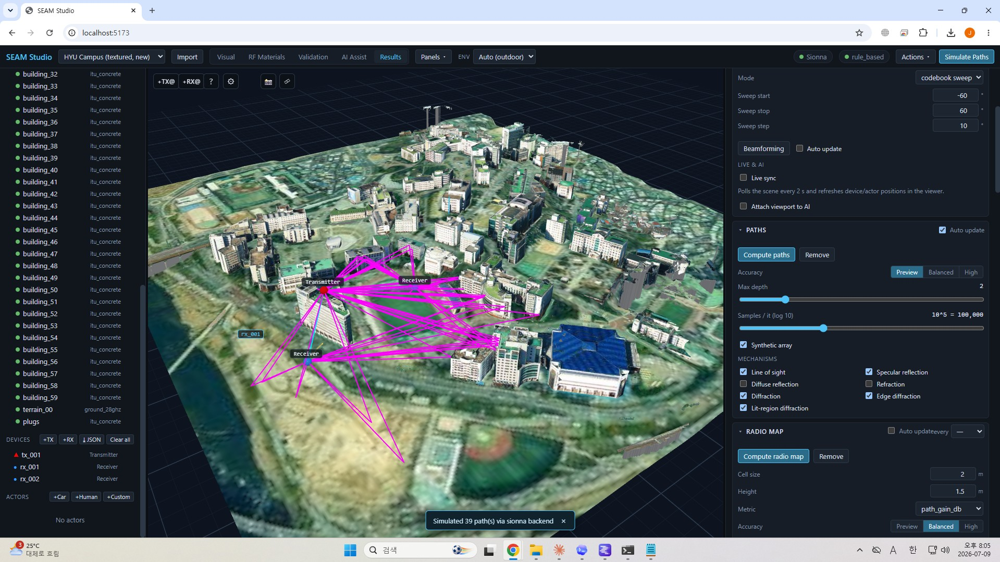

# SEAM Studio

**SEAM** — Scene-to-Electromagnetic Authoring and Mapping for Wireless Digital Twins

> **한국어 README: [README.ko.md](README.ko.md)** · Project page: <https://jaewoo4200.github.io/SEAM/en/>

A **local-first RF digital twin workbench on Sionna RT**. In one textured 3D
scene, every mesh carries **two material bindings** — visual/PBR for rendering
and RF for electromagnetic simulation. The canonical scene compiles into a
Sionna-compatible RF projection, and ray paths / radio maps come back as
overlays in the same viewport.

No GPU, no Sionna, no LLM required — all three are **optional upgrades**.
Core workflows and demos run on the **Mock backend (CPU)**; only
Sionna-specific features need the real backend.

```text
Unified RF-Visual Scene Graph          (scene.seam.json - source of truth; legacy scene.sionnatwin.json)
  ├─ Visual Projection  →  GLB / textures / Three.js viewer
  └─ RF Projection      →  PLY material groups + Mitsuba XML → Sionna RT
```


*The Hanyang University campus twin — a drone/aerial-textured import on continuous terrain, rendered in SEAM Studio.*


*SEAM Studio in one view — the 3D scene viewport with the Visual / RF Materials / Validation / AI Assist / Results modes and a live communication-metrics dashboard.*

| | |
|---|---|
| <br>**Sionna RT ray tracing** — 39 paths between one TX and two RXs (LOS cyan · reflections magenta), solved by the real Sionna backend. | <br>**Campus twin, top-down** — aerial textures on continuous terrain, view snaps (1/3/7) and an infinite grid. |
| <br>**Sample Demo** — TX/RX placement and height-above-surface (AGL) editing; runs on the Mock backend alone. | <br>**Drone-mapped FTC building** — the orthographic multi-view capture that SEAM-Agent reasons over. |

---

## Quickstart (3 commands)

> **Just want to run it?** `pip install seam-studio` then `seam-studio` — no
> checkout, no Node.js (the wheel ships a pre-built UI, and the real `sionna-rt`
> engine installs with it). Details: [INSTALL.md → Route A](INSTALL.md#route-a--pip-install-seam-studio-no-source-checkout).
>
> **Prerequisites (source route):** **Python 3.11–3.14** and **Node.js 20+**
> must be on your PATH. Nothing else is required — `sionna-rt` installs as a base
> dependency; a GPU and a local LLM are optional upgrades layered on top. Full
> list: [INSTALL.md → Prerequisites](INSTALL.md#prerequisites).

**Windows (PowerShell):**

```powershell
powershell -ExecutionPolicy Bypass -File scripts\install.ps1   # 1. install + demos
powershell -ExecutionPolicy Bypass -File scripts\start.ps1     # 2. run backend + frontend
# 3. open http://localhost:5173 (the Sample Demo loads automatically)
```

**Linux / macOS:**

```bash
bash scripts/install.sh   # 1. install + demos
bash scripts/start.sh     # 2. run backend + frontend
# 3. open http://localhost:5173 (the Sample Demo loads automatically)
```

Manual install, engine options and troubleshooting: **[INSTALL.md](INSTALL.md)**.
A 15-minute first session: **[TUTORIAL.md](TUTORIAL.md)**.

---

## How it differs from the official RT GUI

The official NVlabs `sionna-rt-gui` (a Polyscope desktop app) loads scenes,
places/animates TX/RX and shows paths plus raster radio maps — but material
editing, mesh radio maps and beamforming are explicitly out of scope. SEAM
Studio builds on the same Sionna RT engine and adds:

| Feature | `sionna-rt-gui` (official) | SEAM Studio |
|---|:---:|:---:|
| Paths + raster radio map | ✅ | ✅ |
| Unified RF-visual scene graph (**dual material bindings**) | ❌ | ✅ |
| RF material **assignment + validation + AI/rule suggestions** | ❌ | ✅ |
| **Mock backend** (runs without GPU/Sionna) | ❌ | ✅ |
| **MIMO beamforming** gain (codebook sweep / TX-MRT / SVD) | ❌ | ✅ |
| **Channel analysis** (link budget, CIR/CFR, PL models vs RT, multi-TX **SINR**) | ❌ | ✅ |
| **Trajectory RF metrics** (RSS / path gain / RMS delay / interference·SINR) | ❌ | ✅ |
| **RFData export** (AODT viewer contract) | ❌ | ✅ |
| **ML dataset** generation (npz + metadata) | ❌ | ✅ |
| **Swappable Sionna engine versions** (separate venvs) | ❌ | ✅ |
| Web UI (browser) | ❌ (desktop) | ✅ |
| In-viewer device trajectory playback / move gizmo | ✅ | ✅ |

---

## Feature highlights

- **One scene, two materials.** A prim's `visual` and `rf` blocks are separate
  objects that only meet at the prim. A texture filename is never RF truth —
  AI/rules cite it as *evidence* only, and assignments evolve with provenance:
  `unassigned → rule_suggested / ai_suggested → user_confirmed → measurement_calibrated`.
- **Five-mode UI** — Visual / RF Materials / Validation / AI Assist / Results.
  Click an object and its visual + RF materials, assignment sources, validation
  warnings and result overlays all resolve to the same object.
- **Click-to-place & viewport picking** — place TX/RX devices, trajectory
  waypoints and dataset sampling regions by clicking in the viewport instead of
  typing coordinates; scene bounds (`GET /scene/bounds`) pre-fill sensible
  defaults, confirmed with a dotted-line preview.
- **Dockable panels** — move panels between sidebars or float them over the
  viewport (◧/◨/⧉); a "Panels" launcher opens any panel from any mode.
- **Metrics dashboard + paper-ready export** — link KPIs (RSS/RSRP/RSSI/RSRQ/
  SNR/Shannon capacity/delay spread/Doppler…) and CIR·CFR·Doppler·path-loss
  charts in one panel; every figure is white-background Times New Roman with
  built-in **PNG/SVG/CSV export**. The viewport's **Snapshot** (WYSIWYG PNG) and
  **Render** (offline Mitsuba) buttons capture the scene itself.
- **Live channel tuning + 3GPP measurements** — adjust frequency/bandwidth/TX
  power/noise figure/SCS live with auto re-analysis, including **TS 38.215-style
  RSRP/RSSI/RSRQ** over the requested OFDM resource grid.
- **Multi-TX co-channel interference (SINR)** — with several TXs, all non-serving
  ray-traced powers sum into co-channel interference: SINR = S/(I+N) feeds RSSI,
  RSRQ and capacity (full-buffer worst case, no scheduler). Works for channel
  analysis and trajectories; the serving cell is selectable, and it falls back to
  `SINR = SNR` when there is no interfering TX.
- **Deterministic Mock backend** — Friis + image-method reflections compute
  example paths/radio maps with no GPU/Sionna, so the frontend and tests run
  anywhere.
- **Real Sionna RT path** — with `sionna-rt` installed (validated on 2.0.x) the
  compiled `generated_scene.xml` loads directly on GPU (Dr.Jit CUDA) or CPU
  (LLVM) and results normalize into the same schema.
- **AODT alignment** — 28 GHz defaults, ITU-R P.2040 material set (+`human_body`),
  AODT-style dark viewer (LOS cyan / reflection magenta / diffraction orange),
  RFData export contract.
- **Optional local AI** — forced provider → Ollama → rule-based fallback chain,
  strict JSON schema validation, suggestions never auto-apply and always leave
  provenance. Multi-view captures and per-prim texture crops sharpen the
  suggestions.
- **Natural-language rules + validation explains** — turn a sentence like
  "windows are glass, concrete walls are itu_concrete" into reviewable
  assignment rules (`/ai/generate-rules` → `/ai/apply-rules`, scene untouched
  until approval), and get plain-language explanations of validation warnings
  (`/ai/explain-validation`, read-only with one-click `suggested_actions`).
- **RF disambiguation + material impact** — tell visually identical materials
  apart from measured link path gains (`/calibrate/disambiguate`, picks the
  lowest-RMSE candidate and warns when indistinguishable), and quantify
  how much an assignment matters by comparing against a single-material baseline
  (NMSE / cosine similarity / ΔRSS / capacity, `/analyze/material-impact`, KICS 2026).
- **AoA/AoD angle analytics** — every path carries departure/arrival
  `[azimuth, elevation]` plus per-path gain, rendered as paper-style polar
  scatter plots (azimuth = angle, power = radius, AoD filled / AoA hollow
  markers, elevation in CSV and tooltip).
- **Mesh radio maps + region refinement** — paint coverage per triangle on real
  surfaces (walls/floors/roads) instead of a horizontal plane (`/simulate/mesh-radio-map`),
  re-solve only a region of interest (`center_xy`/`size_xy`) at a finer cell
  size, with multi-TX `sinr_db` maps and a
  per-cell **serving-TX** map.
- **Accuracy presets** — pick a representative deployment (28 GHz indoor/outdoor,
  3.5 GHz urban macro, 60 GHz indoor) and every solver knob (depth / mechanism /
  grid) snaps to a vetted configuration; editing any knob by hand switches to Custom.
- **Result reproducibility + live events** — every result is stamped with
  `scene_hash`/`rf_assignment_hash`/`sim_config_hash` + a config snapshot, so
  stale results get badges after any scene/assignment change; a WebSocket
  (`WS /ws/projects/{id}/events`) streams compile/simulation progress without
  polling, and `GET /api/backends` exposes a per-backend capability map.
- **External results & measurements** — import NVIDIA AODT parquet results into
  the same schema (`/results/import-aodt`, stamped with the `aodt_import`
  backend) and measured link CSVs
  (`/calibrate/measurements/import-csv`) for calibration and disambiguation.
- **Scene bundle import (zip / OSM)** — import a whole scene folder (XML +
  meshes + textures) as one zip with relative paths preserved; textures persist
  both viewer-side (GLB) and full-resolution for AI evidence. Or pull real
  buildings from OpenStreetMap by dragging a rectangle on a map (or searching).
- **Material segmentation + connected-parts split** — split a monolithic
  building mesh into per-material faces from a texture mask (color heuristic /
  local-VLM tile vote / uploaded SAM2-grade mask), or split a merged multi-
  building mesh into its connected components. Every split keeps a GLB backup
  and is **undoable**.
- **SEAM-Agent (retrieval-augmented local AI material authoring)** — give one
  hint like "this is the Hanyang FTC building" and the agent retrieves real
  exterior photos from the web, fuses them with multi-view mesh observations
  (region/box-to-mesh back-projection via triangle-id buffers), and proposes
  per-segment RF materials (wall/window/roof/frame) with confidence and evidence
  cards. SAM-style pixel masks are a separate segmentation-upload path (see
  material segmentation above). Everything is an observable activity trace, and
  nothing applies without your approval.
- **Blender-grade viewport** — zoom-to-cursor, 1/3/7 view snaps, orbit around
  selection, infinite grid, distance fog, and an unlit-texture toggle for
  photo-textured scenes.
- **Terrain following** — UE trajectories drape onto terrain/rooftops (no more
  tunneling through hills), and the device inspector's **height-above-surface
  (AGL)** field places a device "N meters above whatever is below it" in one
  step.
- **UAV actors + entity view** — car / pedestrian / UAV / custom scatterers move
  along waypoint trajectories (a UAV's z is its flight altitude, so it can hover
  in place or fly a 3D path); clicking any TX/RX/actor opens a live
  picture-in-picture view from that entity toward a selectable link partner,
  with ray overlays visible in it — a BS-perspective look at the UE.
- **AI model picker** — models loaded in LM Studio / Ollama are auto-discovered
  and switchable in the UI; the responding model is recorded in provenance.

See [TUTORIAL.md](TUTORIAL.md) for the full demo flow.

---

## Programmatic API (endpoints without UI buttons)

Most features are driven from the web UI; these two endpoints are meant for
curl/scripts (backend defaults to `http://127.0.0.1:8000`):

- **`POST /api/projects/{id}/live/state`** — **inject real-world positions.**
  Push device/actor positions from GPS/mocap/logs into the loaded scene. The
  UI's *Live sync* polling mirrors this state, so a steady stream of posts makes
  the viewer follow in real time. With `persist=false` (default) the positions
  live in an ephemeral in-memory overlay that `GET /scene` and periodic
  re-solves apply on read (no disk write; cleared on any authoritative save);
  `persist=true` writes them into the stored scene. `resimulate=true` re-solves
  paths immediately for a measure → sync → predict loop.

  ```bash
  curl -X POST http://127.0.0.1:8000/api/projects/sample_demo/live/state \
    -H "Content-Type: application/json" \
    -d '{"devices":[{"id":"rx_001","position":[10.0,5.0,1.5]}],"actors":[{"id":"veh_001","position":[20.0,0.0,0.0],"orientation_deg":[0.0,0.0,90.0]}],"resimulate":true,"persist":false}'
  ```

- **`POST /api/projects/{id}/calibrate/materials`** — **measurement-driven
  material calibration.** Provide measured per-link path gains and one RF
  material parameter is grid-search fitted to reduce RT-vs-measurement error,
  returning a before/after report. With `apply=true` the fitted value is written
  to the library and affected prims are promoted to `measurement_calibrated`.

  ```bash
  curl -X POST http://127.0.0.1:8000/api/projects/sample_demo/calibrate/materials \
    -H "Content-Type: application/json" \
    -d '{"measurements":[{"rx_position":[10.0,5.0,1.5],"measured_path_gain_db":-92.0}],"target_material_id":"concrete","param":"scattering_coefficient","apply":false}'
  ```

  Device/trajectory JSON import (`POST /import/devices`, `/import/trajectory`,
  `GET /import/templates`) is documented in
  [docs/point_import.md](docs/point_import.md).

---

## Docs index

| Doc | Contents |
|---|---|
| [INSTALL.md](INSTALL.md) | prerequisites, install (scripts/manual), engine & LLM options, troubleshooting |
| [TUTORIAL.md](TUTORIAL.md) | 15-minute first session (scene → materials → sim → dataset) |
| [docs/guides/getting_started.md](docs/guides/getting_started.md) | illustrated guide: first launch, toolbar, modes, panels |
| [docs/guides/scene_import.md](docs/guides/scene_import.md) | illustrated guide: Mitsuba XML / OSM / device JSON imports |
| [docs/guides/materials_and_ai.md](docs/guides/materials_and_ai.md) | illustrated guide: RF materials, validation, AI-assisted assignment |
| [docs/guides/simulation.md](docs/guides/simulation.md) | illustrated guide: paths, radio maps, beamforming, channel analysis |
| [docs/guides/trajectory_uav.md](docs/guides/trajectory_uav.md) | illustrated guide: trajectories, UAV actors, playback, POV views |
| [docs/guides/datasets_export.md](docs/guides/datasets_export.md) | illustrated guide: ML datasets and exports |
| [docs/architecture.md](docs/architecture.md) | unified scene graph & dual-projection architecture |
| [docs/scene_format.md](docs/scene_format.md) | scene/project folder format and schemas |
| [docs/rf_materials.md](docs/rf_materials.md) | RF material library and models |
| [docs/ai_assistant.md](docs/ai_assistant.md) | AI suggestion providers, rules, provenance |
| [docs/engines.md](docs/engines.md) | swapping Sionna engine versions (separate venvs) |
| [docs/sionna_versions.md](docs/sionna_versions.md) | Sionna feature/material/model history by version (vetted literature) |
| [docs/rtgui_parity.md](docs/rtgui_parity.md) | NVlabs Sionna RT GUI feature-parity matrix |
| [docs/model_validation.md](docs/model_validation.md) | verification of every implemented comms model |
| [docs/dynamic_scattering.md](docs/dynamic_scattering.md) | dynamic scattering / Doppler survey & implementation notes |
| [docs/ml_datasets.md](docs/ml_datasets.md) | ML ground-truth dataset format & training examples |
| [docs/point_import.md](docs/point_import.md) | device/trajectory JSON import format (cartesian & geographic) |
| [docs/extending.md](docs/extending.md) | plugin architecture & extension guide |
| [docs/accuracy.md](docs/accuracy.md) | RT-vs-measurement error and mitigations |
| [docs/roadmap.md](docs/roadmap.md) | post-MVP roadmap and extension points |
| [docs/research_ideas.md](docs/research_ideas.md) | publishable research directions |
| [HANDOFF.md](HANDOFF.md) | the operating specification this implementation follows |

---

## Architecture (one-liner)

A canonical Pydantic v2 scene (`scene.seam.json`, legacy `scene.sionnatwin.json`)
is the single source of truth; the FastAPI backend compiles it into Visual (GLB)
and RF (Mitsuba XML +
PLY groups) projections, and the React + react-three-fiber frontend mirrors the
snake_case wire format, drawing results back onto the same Z-up ENU-meters
scene.

**Stack:** Python 3.11+ / FastAPI / Pydantic v2 / NumPy / trimesh backend;
React + Vite + TypeScript + react-three-fiber + Zustand frontend; optional
`sionna-rt` (Dr.Jit / Mitsuba 3) backend.

---

## Repository layout

```text
backend/    FastAPI app: schemas (Pydantic v2), project store, scene validator,
            RF material assignment, RF projection compiler (trimesh),
            simulation backends (Mock + optional Sionna RT), AI providers
frontend/   React + Vite + TypeScript + react-three-fiber workbench
examples/   demo project generators (sample_demo, lab_room import)
scripts/    install / start scripts (PowerShell + bash)
docs/       architecture, scene format, RF materials, AI, engines, accuracy, roadmap
HANDOFF.md  operating specification this implementation follows
```

---

## Testing

```bash
backend/.venv/bin/python -m pytest backend/tests -q   # backend unit tests
cd frontend && npm run build                          # typecheck + build
```

(Windows: `backend\.venv\Scripts\python.exe -m pytest backend\tests -q`)

---

## License / Credits

Distributed under the [Apache License 2.0](LICENSE) (third-party notices:
[NOTICE](NOTICE)). Built on [Sionna RT](https://github.com/NVlabs/sionna-rt)
(NVlabs); AODT viewer alignment follows the `reference-bundle/` reference
bundle (28 GHz FTC / lab-room ISAC digital twins).

**Map data attribution** — the OSM import fetches building footprints via the
[Overpass API](https://overpass-api.de/) and geocoding via Nominatim. That data
is **© OpenStreetMap contributors**, licensed under
[ODbL 1.0](https://www.openstreetmap.org/copyright) — scenes built with the OSM
import carry the same attribution requirement when redistributed. The import
dialog's map uses [Leaflet](https://leafletjs.com/) (BSD-2) with standard OSM
tiles.

Developed by **Jaewoo Lee (이재우)** at the
**[Wireless Systems Laboratory (WSL)](https://wsl.hanyang.ac.kr/), Hanyang University** ·
**[BEYOND-G Global Innovation Center](https://beyond-g.hanyang.ac.kr/)**.
GitHub: <https://github.com/jaewoo4200/SEAM>
