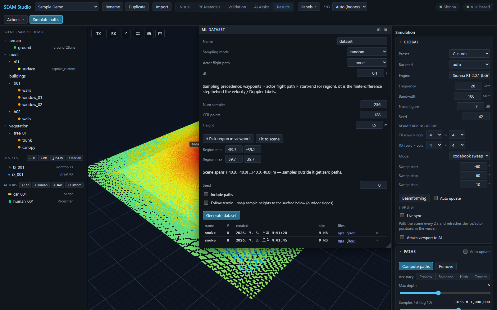

# ML datasets and exports

> **English** · [한국어](datasets_export.ko.md)

SEAM Studio is not just a viewer — everything you simulate can leave the app as
files: NumPy `.npz` ground-truth datasets for training ML models, an
AODT-viewer-compatible RFData bundle, WYSIWYG viewport captures, and per-chart
CSV/PNG/SVG exports. This guide walks through each export path.

Everything here works with the **Mock backend** too — if Sionna RT is not
installed, dataset generation and all exports still run end to end (the numbers
come from the mock solver, which is fine for testing pipelines).

---

## 1. The ML dataset panel

The dataset generator lives in the **ML dataset** panel (its header renders as
`ML DATASET`). You can reach it two ways:

- **Results** mode — it is one of the dockable cards on the right.
- From any mode via the toolbar **Panels ▾** menu — click the **ML dataset**
  row to float it over the viewport, or dock it left/right with the **◧ / ◨**
  buttons. A floated panel stays visible when you switch modes.

*The ML DATASET panel floated over a computed radio map — sampling controls on top, the region picker in the middle, and the dataset list with `npz` / `json` downloads at the bottom.*

### Generate a dataset step by step

1. **Name** — the dataset's display name (it also appears in the list below).
2. **Sampling mode** — how UE positions are chosen:
   - `random` — uniform random positions inside the region,
   - `grid` — a regular grid over the region (adds a **Grid spacing** field, in m),
   - `trajectory` — points along a straight start→end line.
3. **Actor flight path** — optionally sample along a scene actor's authored
   trajectory (a car, pedestrian, or UAV with waypoints). Pick an actor here and
   it **overrides** the region / start-end below; leave it at `— none —` to use
   the sampling mode's own geometry. If no actor has a trajectory yet, the panel
   says so — assign one in Visual mode first. The hint under the field spells
   out the precedence: *waypoints > actor flight path > start/end (or region)*.
4. **dt** (s) — the finite-difference time step behind the velocity / Doppler
   labels the backend adds to moving samples.
5. **Num samples** — how many UE positions to solve (1–20000).
   **CFR points** — frequency-response samples per position (2–4096).
   **Height** (m) — the UE sampling height.
6. Set the region (for `random` / `grid`):
   - **⌖ Pick region in viewport** — the button switches to
     `Click 2 corners… (Esc)`; click two opposite corners of the region on the
     scene surface and the XY fields fill in (Esc cancels).
   - **Fit to scene** — sets the region and height to cover the whole scene
     (the panel also seeds itself from the real scene bounds when a project
     loads, so you rarely start from garbage values).
   - **Region min** / **Region max** — the XY corners as numbers.
   - Watch the hint line, e.g. *"Scene spans [-40.0, -40.0]…[40.0, 40.0] m —
     samples outside it get zero paths."* Sampling outside the geometry is the
     #1 cause of useless datasets.

   For `trajectory` mode you instead get **⌖ Pick path in viewport** plus
   **Start** / **End** XYZ fields.
7. **Seed** — makes the random sampling reproducible; record it for papers.
8. **Include paths** — additionally dumps every sample's full ray paths
   (vertices + interactions) as `paths.jsonl`. Large; off by default.
9. **Follow terrain** — snaps each sample's height to the surface below it
   plus the height offset. Use it on sloped outdoor scenes; leave it off
   indoors (it would snap to the roof).
10. Press **Generate dataset**. The button shows `Generating…` while the solver
    sweeps the positions.

### The dataset list

Finished datasets appear in the table below the button, one row each:

- **name / # / created / size** — name, sample count, creation time, file size.
- **files** — download links for **npz** (`dataset.npz`, the arrays) and
  **json** (`metadata.json`, the config echo + conventions).
- A **⚠ N zero-path** flag on the name means N samples produced no paths at
  all (UE outside the scene or fully occluded) — re-check your region.
- The **×** button deletes a dataset; it arms to **✓?** and you click again to
  confirm (it auto-disarms after a few seconds).

On disk, datasets live under the project folder at
`export/datasets/<dataset_id>/`.

### What is in the labels

The `.npz` contains per-sample positions, complex CFR, per-path CIR gains and
delays, LOS flags, RSS, and dispersion metrics — the exact array schema, the
AODT field mapping, and a ready-to-run training example
(`examples/ml/train_channel_estimator.py`) are documented in
[ML ground-truth datasets](../ml_datasets.md).

---

## 2. RFData export (AODT-viewer bundle)

To hand results to an external AODT-style viewer or your own pipeline, use the
toolbar: **Actions ▾ → Export RFData**. It writes a bundle to
`export/rfdata/` inside the project folder:

| File | Content |
|---|---|
| `scenario_meta.json` | units, frequency, coordinate transform, time window |
| `devices.json` | transmitters + receivers (positions in meters) |
| `paths.json` | time-indexed ray paths |
| `trajectory.csv` | per-waypoint UE metrics (`time_s, ue_id, x_m, y_m, z_m, rss_dbm, sinr_db, path_gain_db`) |
| `radio_map.csv` | plane heatmap samples |
| `calibration_points.json` | 3 coordinate-check reference points |

After the export, a dismissible row appears in **Results** — *"Exported RFData
to `export/rfdata`"* — with a download link per file, so you don't have to dig
through the project folder.

---

## 3. Viewport captures — Snapshot and Render

The two icon buttons in the bottom-right cluster of the viewport save scene
images:

- **Snapshot** (camera icon) — saves *exactly* what you see (WYSIWYG): current
  camera pose, rays, markers, radio-map overlay, at full canvas resolution, as
  PNG. The tooltip reads *"Save this exact view as a PNG (what you see, full
  resolution — paper-ready)"*. This is the button for paper and slide figures.
- **Render** (film icon) — an offline, physically shaded path-traced render via
  Mitsuba. Slower, and deliberately *not* the on-screen view — no rays or
  overlays, just the shaded scene.

The entity **POV inset** (the live first-person view from a device or actor)
has its own camera button that saves the POV frame as a full-resolution PNG.

---

## 4. CSV and figure exports from the dashboards

- Every chart in the **Metrics dashboard** panel (and the other paper-styled
  charts) sits in a frame with **PNG / SVG / CSV** buttons in its header —
  bitmap at 3×, vector, or the raw data as CSV. Figures export as shown: white
  background, Times New Roman.
- The dashboard header has an **Export all (CSV)** button that downloads the
  entire KPI table as `metric,value,unit` rows.
- The paths table in **Results** has **Export filtered CSV (N)** — it exports
  exactly the currently filtered path set, one row per path with type, power,
  delay, and interaction materials.

---

## Related docs

- [ML ground-truth datasets](../ml_datasets.md) — the `.npz` schema, zero-path
  warnings, AODT field mapping, and the training example script.
- [Getting started](getting_started.md) — install, first project, the mode tabs.
- [Simulation guide](simulation.md) — paths, radio maps, and the solver
  settings a dataset inherits.
- [Scene & project format](../scene_format.md) — where files live inside a
  project folder.
- [Sionna versions](../sionna_versions.md) — the `engine` recorded in
  `metadata.json` for reproducibility.
- [15-minute tutorial](../../TUTORIAL.md) — the full first-session loop,
  including dataset generation.
