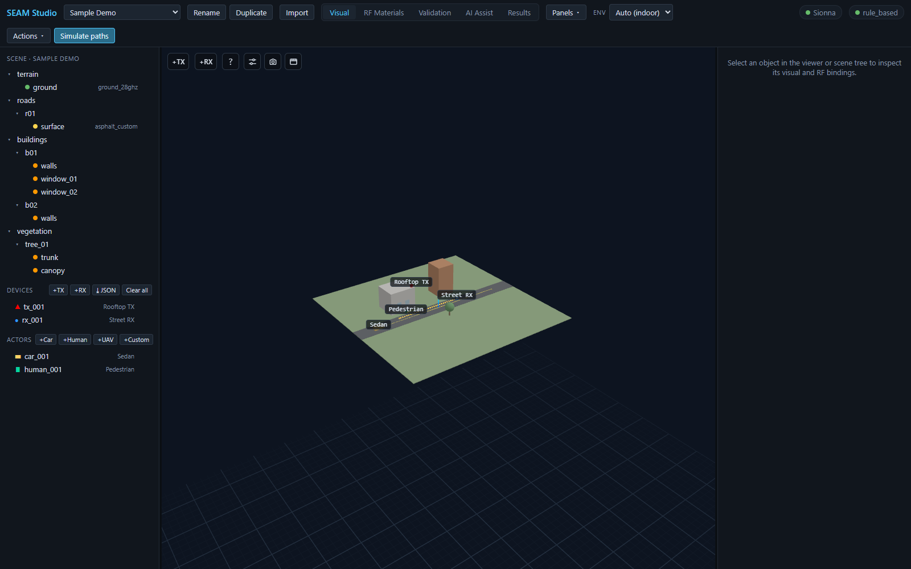
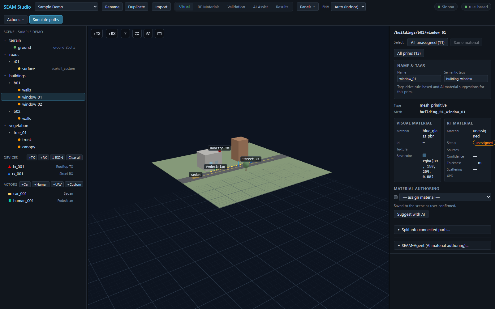

# 시작하기: 첫 실행과 UI 둘러보기

> [English](getting_started.md) · **한국어**

이 가이드는 설치 직후부터 SEAM Studio 화면에 익숙해질 때까지를 다룹니다:
툴바, 다섯 가지 모드 탭, 씬 트리, 인스펙터, 도킹 가능한 패널.
GPU·Sionna·LLM 없이도 내장 **Mock 백엔드**만으로 여기 나오는 모든 내용이
동작합니다. 전체 설치 절차는 [INSTALL.md](../../INSTALL.ko.md)를 참고하세요.

---

## 1. 설치와 실행

SEAM Studio를 실행하는 방법은 두 가지입니다. 하나를 고르세요.

### 방법 A — pip 설치 (패키지 앱)

```bash
pip install seam-studio
seam-studio
```

`seam-studio` 명령은 **http://127.0.0.1:8000** 에 서버를 띄우고 브라우저를
자동으로 엽니다. 첫 실행 시 `~/.seam/projects` 에 **Sample Demo** 프로젝트를
자동 생성하므로 앱이 빈 화면으로 시작하지 않습니다. 유용한 플래그:
`--port 9000`, `--project-root D:\twins`, `--no-browser`.

### 방법 B — 소스 체크아웃 (개발 서버)

저장소를 클론하고 설치 스크립트를 한 번 실행한 뒤
([INSTALL.md](../../INSTALL.ko.md)에 단계별 설명이 있습니다) 두 서버를
띄웁니다:

```bash
# Windows
powershell -ExecutionPolicy Bypass -File scripts\start.ps1
# Linux/macOS
bash scripts/start.sh
```

백엔드는 :8000, Vite 개발 프론트엔드는 **http://localhost:5173** 에 뜹니다 —
브라우저에서는 :5173 주소를 여세요. 이 가이드는 개발 서버 URL 기준으로
설명하지만 패키지 앱도 화면은 동일합니다.

---

## 2. 툴바


*Sample Demo 프로젝트의 Visual 모드 — 씬 트리, 디바이스 `tx_001` / `rx_001`, 액터 `car_001` / `human_001`, 그리고 툴바.*

상단 툴바에는 왼쪽부터 다음이 있습니다:

1. **SEAM Studio** 타이틀과 **프로젝트 셀렉트**. Sample Demo 프로젝트가
   자동 로드되며, 여기서 프로젝트를 전환합니다.
2. **Rename** / **Duplicate** — 현재 프로젝트의 표시 이름을 인라인으로
   바꾸거나(Enter 저장, Esc 취소), 프로젝트 폴더 전체를 복제해 사본을 엽니다.
3. **Import** — 새 씬을 새 프로젝트로 불러옵니다. **Mitsuba XML** 파일
   (메시·텍스처가 든 .zip 번들도 가능) 또는 좌표로 가져오는
   **OpenStreetMap** 사각형 영역 중에서 고릅니다.
4. 다섯 가지 **모드 탭**:

   | 탭 | 하는 일 |
   |---|---|
   | **Visual** | 3D 씬 탐색, 픽킹, 씬 트리, 인스펙터. |
   | **RF Materials** | RF 재질별 색 오버레이; 드롭다운으로 지정. |
   | **Validation** | 씬 검증 경고(미지정 재질 등). |
   | **AI Assist** | AI 재질 제안과 검토·승인 워크플로. |
   | **Results** | 경로/라디오맵/빔포밍/채널 등 모든 시뮬레이션. |

5. **Panels ▾** — 도킹 가능한 패널 전체를 현재 도킹 상태와 함께 나열합니다.
   행을 클릭하면 플로팅됩니다([5절](#5-도킹-가능한-패널) 참고).
6. **Env** 셀렉트 — `Auto (indoor)`, `Indoor`, `Outdoor`. `Auto`로 두면
   앱이 환경을 추론해 그에 맞는 솔버 프리셋을 적용하고, 추론된 값이
   괄호 안에 표시됩니다.
7. **상태칩** 두 개:
   - **Sionna** / **Mock only** — 실제 레이 트레이싱 백엔드 설치 여부.
     UI를 익히는 단계에서는 `Mock only`로 충분합니다.
   - 제공자 이름(예: `rule_based`) / **AI off** — 활성화된 AI 제안 제공자.
8. **Actions ▾** (Validate, Compile RF, Beamforming, Export RFData,
   Delete project…)와 파란 **Simulate paths** 버튼.

---

## 3. Visual 모드 둘러보기

**Visual** 탭에 머문 채 왼쪽 사이드바를 보세요.

### 씬 트리

트리는 씬 계층 구조(`/buildings/b01/walls`, `/roads/r01/surface`, …)를
그대로 보여줍니다. 메시 행마다 RF 재질 지정 상태를 나타내는 상태 점,
지정된 재질 id, 그리고 뷰어에서 숨기고 보이는 눈 토글(◉/◌)이 붙습니다.
행을 클릭하면 오브젝트가 선택되고, Ctrl+클릭으로 다중 선택합니다.

### Devices 섹션

**Devices** 헤더에는 버튼 네 개가 있습니다:

- **+TX** / **+RX** — 송신기/수신기를 추가합니다.
- **⤓ JSON** — JSON 파일에서 TX/RX 디바이스를 불러옵니다(직교 x/y/z 또는
  위경도 lat/lon; [point_import.md](../point_import.ko.md) 참고).
- **Clear all** — 모든 무선 디바이스를 제거합니다(두 번 클릭해 확인).

Sample Demo에는 `tx_001`("Rooftop TX", 빨강 ▲)과 `rx_001`("Street RX",
파랑 ●)이 들어 있습니다. 각 행에는 × 삭제 버튼이 있습니다.

### Actors 섹션

액터는 자체 RF 형상을 가진 움직이는 산란체입니다. **Actors** 헤더의
**+Car**, **+Human**, **+UAV**, **+Custom** 으로 추가합니다. 데모에는
도로를 달리는 `car_001`(승용차)과 보행자 `human_001`이 있습니다.

### 탐색과 픽킹

- **좌드래그** — 씬 주위를 궤도 회전(orbit).
- **우드래그** — 화면 이동(pan).
- **휠 스크롤** — 줌.
- **오브젝트 클릭** — 선택(오른쪽 인스펙터가 갱신됩니다). 디바이스나
  액터를 클릭하면 드래그로 옮길 수 있는 X/Y/Z 이동 기즈모도 나타납니다.

---

## 4. 인스펙터


*`window_01`의 인스펙터 — 시맨틱 태그 `building, window`, visual 재질 `blue_glass_pbr`, RF 재질은 아직 미지정(unassigned).*

트리나 뷰포트에서 창문 프림(`/buildings/b01/window_01`)을 클릭하세요.
인스펙터에는 위에서부터 다음이 나옵니다:

1. **Name & tags** — 프림의 표시 이름과 쉼표로 구분된 **Semantic tags**
   (여기서는 `building, window`). 태그는 규칙 기반·AI 재질 제안의 근거가
   되며, 두 필드 모두 Enter 또는 포커스 아웃 시 저장됩니다.
2. 나란히 놓인 두 컬럼:
   - **Visual material** — 오브젝트가 *어떻게 보이는가*: 재질 이름/id
     (`blue_glass_pbr`), 텍스처, 기본 색.
   - **RF material** — *전자기적으로 어떻게 행동하는가*: 재질, 지정 상태
     배지(데모의 창문은 `unassigned`로 시작), 소스, 신뢰도, 두께, 산란,
     XPD.

   이 분리가 이 앱의 핵심 아이디어입니다. 파란 유리 텍스처만으로는 RF
   관통손실을 확정할 수 없으므로, 두 바인딩을 따로 저작하고 검증합니다.
3. **Material authoring** — 이를 해결하는 모든 방법이 한곳에 모여 있습니다:
   - RF 재질을 직접 지정하는 드롭다운(user-confirmed로 저장),
   - **Suggest with AI** — AI 제공자에게 제안을 요청하고 AI Assist 검토
     화면으로 이동,
   - **Split into connected parts…** — 병합된 메시(예: 도시 블록 전체가
     한 덩어리로 익스포트된 경우)를 부품별 프림으로 분리,
   - **SEAM-Agent (AI material authoring)…** — 메시의 멀티뷰 렌더를
     캡처·분할하고 영역별 RF 재질을 근거와 함께 제안하는 에이전트.

디바이스를 선택하면 대신 편집 가능한 디바이스 카드(위치, 출력, 안테나
어레이, 지향)가, 액터를 선택하면 포즈·크기·RF 재질·부착 디바이스·웨이포인트
궤적 편집기가 나옵니다.

---

## 5. 도킹 가능한 패널

결과 패널(Metrics dashboard, Channel analysis, UE trajectory, Scenario
playback, ML dataset)은 포토 에디터 스타일로 도킹할 수 있습니다. 각 패널
헤더 오른쪽의 작은 버튼으로 옮깁니다:

- **◧ / ◨** — 왼쪽/오른쪽 사이드바로 도킹.
- **⧉** — 뷰포트 위에 뜨는 **플로팅 창**으로 분리. 헤더를 드래그해 옮기고,
  가장자리를 드래그해 크기를 바꿉니다.

플로팅한 패널은 모드 탭을 바꿔도 그대로 유지됩니다 — Channel analysis
패널을 띄워 두면 Visual 모드에서 씬을 편집하는 동안에도 계속 보입니다.
툴바의 **Panels ▾** 메뉴로는 어느 모드에서든 모든 패널에 접근할 수
있습니다: 행을 클릭하면 플로팅되고(이미 떠 있으면 앞으로 가져옴), 행 옆의
◧/◨ 버튼으로 다시 도킹합니다.

---

## 다음 단계

[15분 튜토리얼](../../TUTORIAL.ko.md)을 따라 해 보세요 — 재질 지정부터
경로 시뮬레이션, 라디오맵, ML 데이터셋 내보내기까지 전체 루프를 Mock
백엔드만으로도 한 바퀴 돌 수 있습니다.

## 관련 문서

- [TUTORIAL.md](../../TUTORIAL.ko.md) — 15분 첫 세션 튜토리얼
- [INSTALL.md](../../INSTALL.ko.md) — 전체 설치 가이드(Sionna RT, 로컬 LLM)
- [architecture.md](../architecture.ko.md) — 프론트엔드·백엔드·엔진 구조
- [scene_format.md](../scene_format.ko.md) — `.seam` 프로젝트/씬 포맷
- [rf_materials.md](../rf_materials.ko.md) — RF 재질 라이브러리
- [ai_assistant.md](../ai_assistant.ko.md) — AI 재질 제안 워크플로
