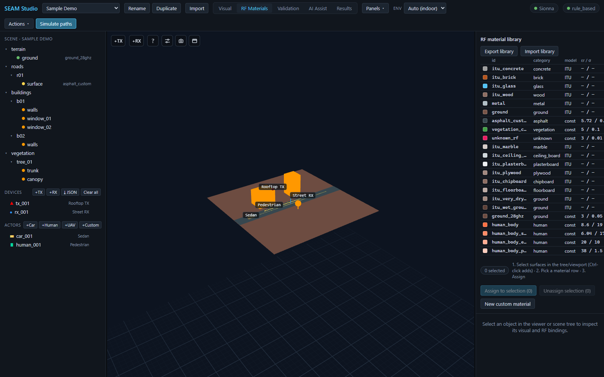
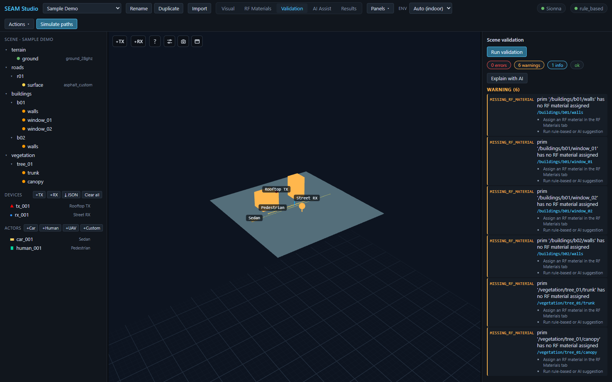
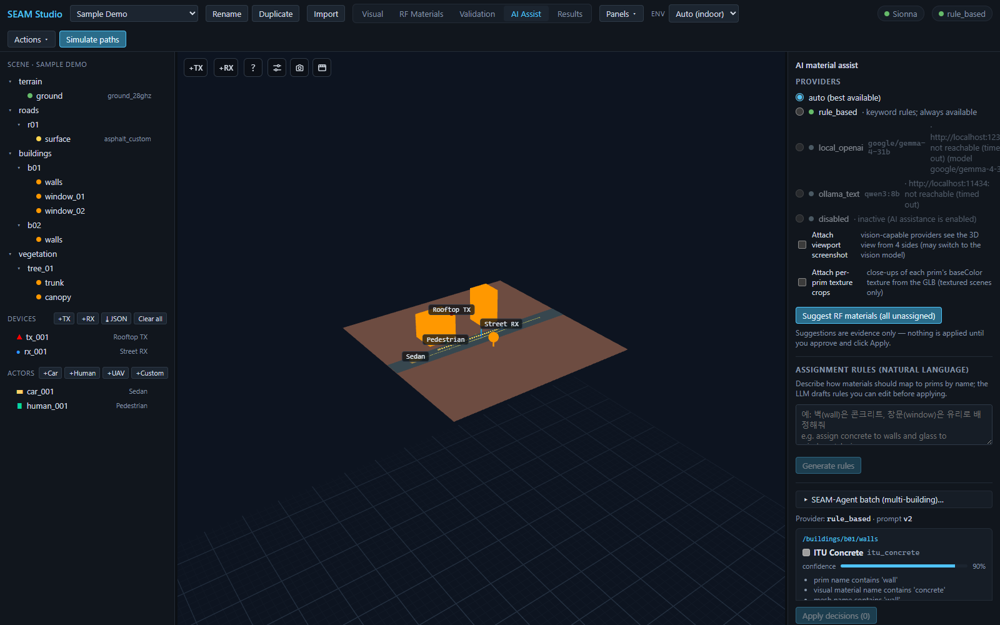

# RF 재질: 라이브러리·검증·AI 지원 지정

> [English](materials_and_ai.md) · **한국어**

눈으로 보기에 완성된 텍스처 씬이라도 RF 관점에서는 아직 준비가 안 된
상태일 수 있습니다. 이 가이드는 시각적 지오메트리를 시뮬레이션 가능한
디지털 트윈으로 만드는 세 가지 모드 — **RF Materials** 라이브러리,
**Validation**, **AI Assist** — 를 차례로 살펴봅니다. 여기 나오는 모든
기능은 Mock 백엔드만으로 동작하므로 GPU나 Sionna RT 설치 없이 따라 할 수
있습니다.

---

## 1. RF 재질이 왜 중요한가

레이 트레이서는 각 표면의 전자기 특성 — 비유전율(εr), 전도도(σ), 두께,
산란·XPD 계수 — 로부터 모든 반사·투과·회절을 계산합니다. 시각/PBR 재질은
표면이 *어떻게 보이는지*를 말해줄 뿐, 28 GHz 전파가 그 표면에서 어떻게
튕기는지는 전혀 알려주지 않습니다. 그래서 SEAM Studio는 둘을 의도적으로
분리합니다: 모든 메시 프림은 시각 재질과 RF 재질 바인딩을 *각각* 가지며,
인스펙터에 나란히 표시됩니다.

프림에 RF 재질이 없으면 솔버가 그 표면을 제대로 모델링할 수 없습니다 —
그래서 미지정 표면은 RF 오버레이에서 **경고 주황색으로 빛나고**, 검증에서
`MISSING_RF_MATERIAL` 경고가 나옵니다.

파일 포맷과 기본 라이브러리 전체 표는
[../rf_materials.ko.md](../rf_materials.ko.md)를 보세요.

---

## 2. RF Materials 모드 — 라이브러리와 지정

**RF Materials** 탭으로 전환하세요. 뷰포트의 모든 프림이 RF 재질의
프리뷰 색으로 다시 칠해지고, 미지정 프림은 주황색으로 빛납니다. 오른쪽의
**RF material library** 패널에 프로젝트의 재질 목록이 나옵니다:

*RF Materials 모드 — 라이브러리 표(`id` / `category` / `model` / `εr / σ`), 그 아래의 지정 버튼, 그리고 주황색으로 빛나는 미지정 건물들.*

표의 열은 다음과 같습니다:

- **id** — 지정에 쓰는 재질 id (예: `itu_concrete`, `itu_glass`,
  `asphalt_custom`).
- **category** — concrete, glass, ground, human 등.
- **model** — `ITU` 또는 `const`. **ITU** 항목은 εr/σ를 *시뮬레이션
  주파수에서* ITU-R P.2040 파라미터화로 유도하므로 **εr / σ** 열이
  `— / —`로 표시됩니다. **const** 항목(`asphalt_custom`, `ground_28ghz`
  등)은 표시된 고정 εr/σ 값을 모든 주파수에서 그대로 씁니다 — 실측값이나
  문헌값에 쓰되, 값이 유효한 대역에 주의하세요.

### 선택 영역에 재질 지정하기

1. 씬 트리나 뷰포트에서 표면을 선택합니다 — **Ctrl-클릭으로 추가
   선택**됩니다. 패널의 카운터 칩에 `N selected`가 표시됩니다.
2. 표에서 재질 행을 클릭해 활성화합니다.
3. **Assign to selection (N)** 을 누릅니다.

오버레이 색이 즉시 바뀌고, 바인딩은 `user_confirmed` 상태로 프로젝트에
저장됩니다. 선택된 프림 일부가 이미 *다른* 재질을 user_confirmed 상태로
갖고 있으면 버튼이 2단계 확인(`N assigned — overwrite?`)으로 바뀌어, 한
번의 클릭으로 수동 결정이 조용히 사라지는 일을 막아줍니다.
**Unassign selection (N)** 은 바인딩을 지우며, 확인된 지정에 대해서는
같은 2단계 가드가 걸립니다.

### 커스텀 재질

**New custom material** 을 누르고 이름을 입력하면(id는 이름에서 자동
생성됩니다. 예: "My Facade Glass" → `my_facade_glass`) **Create** 로
만듭니다. 라이브러리 행이 활성화된 상태였다면 그 재질을 복제해서
시작합니다. 아무 행이나 클릭하면 표 아래에 편집기가 열리고 **Display
name**, **Relative permittivity εr**, **Conductivity σ (S/m)**,
**Thickness (m)**, **Scattering coeff (0–1)**, **XPD coeff (0–1)**,
**Preview color** 필드를 고쳐 **Save material** 로 저장합니다. εr/σ를
비워 두면 시뮬레이션 시점에 ITU 주파수 의존 모델로 폴백합니다. 커스텀
재질은 **Delete material** 로 지울 수 있고(첫 클릭은 확인 대기, 두 번째
클릭이 삭제), 빌트인 재질은 지울 수 없습니다.

### 프로젝트 간 라이브러리 이동

- **Export library** — 라이브러리 전체를 이동 가능한 JSON 파일로
  내려받습니다. 보정을 마친 재질을 다른 프로젝트에서 재사용할 때
  유용합니다.
- **Import library** — 라이브러리 JSON을 현재 프로젝트에 병합합니다.
  id가 겹치면 서버가 이름을 바꿔서 들여오고, 절대 덮어쓰지 않습니다.

---

## 3. Validation 모드 — 빠진 것 찾기

**Validation** 탭으로 전환해 **Run validation** 을 누르세요. **Scene
validation** 패널이 결과를 심각도 칩 — errors, warnings, info — 과 전체
상태 칩(`ok` / `blocked`)으로 요약합니다:

*Sample Demo 검증 결과: `MISSING_RF_MATERIAL` 경고 6건. 각 카드가 해당 프림을 지목하고 구체적인 다음 단계를 나열합니다.*

각 이슈 행에는 기계 판독용 코드, 메시지, 해당 프림 id가 표시되고 —
**행을 클릭하면 그 프림이 씬에서 선택**되어 하나씩 고쳐 나갈 수
있습니다. `MISSING_RF_MATERIAL` 경고에는 "Assign an RF material in the RF
Materials tab", "Run rule-based or AI suggestion" 같은 프림별 조치 힌트가
붙습니다. 이 외에도 알 수 없는 재질 id, 시각/RF 모순, 두께 누락, 잘못된
메시 참조 등을 검사합니다.

리포트가 읽기 어렵다면 **Explain with AI** 를 누르세요. 검증을 다시
돌린 뒤 각 이슈를 권장 조치와 함께 평문으로 풀어 설명해 줍니다. 씬을
절대 바꾸지 않는 읽기 전용 기능이며, 로컬 LLM 제공자(예: Ollama)가
필요합니다 — 없으면 명확한 안내 메시지가 대신 나옵니다.

---

## 4. AI Assist 모드 — 근거 기반 제안

**AI Assist** 탭으로 전환하세요. **AI material assist** 패널은
**Providers** 목록으로 시작합니다:

*AI Assist — 제공자 목록(여기서는 `rule_based`만 도달 가능), 자연어 규칙 입력란, 그리고 근거와 함께 ITU Concrete를 90% 신뢰도로 추천하는 제안 카드.*

- **auto (best available)** — 도달 가능한 제공자 중 최선을 자동
  선택합니다.
- **rule_based** — 프림 이름·시각 재질 이름·태그에 대한 결정론적 키워드
  규칙. 서버가 필요 없어 항상 사용 가능합니다 — 그래서 전체 흐름이
  오프라인에서도, Mock 백엔드만으로도 동작합니다.
- **local_openai** — 로컬 OpenAI 호환 서버(예: LM Studio).
- **ollama_text** — 로컬 Ollama 서버.
- **disabled** — AI 끔.

각 행에는 도달성 점이 붙고, 도달 불가한 제공자는 상세 메시지와 함께
회색으로 비활성화됩니다(툴바에도 활성 제공자 이름 또는 **AI off** 가
표시됩니다). `local_openai`/`ollama_text`를 고르면 특정 모델을 고정할 수
있는 **Model** 셀렉트가 나타납니다.

비전 지원 모델에 시각 근거를 추가로 보내는 체크박스가 두 개 있습니다:

- **Attach viewport screenshot** — 제공자가 3D 뷰를 4방향에서 봅니다
  (Ollama는 비전 모델로 전환될 수 있음).
- **Attach per-prim texture crops** — GLB에서 잘라낸 프림별 baseColor
  텍스처 클로즈업(텍스처 씬 전용).

### 제안 → 검토 → 적용

**Suggest RF materials (all unassigned)** 를 누르세요(선택이 있으면
`(N selected)`로 바뀝니다). 제안은 카드 단위로 도착합니다: 프림 id,
추천 재질(예: **ITU Concrete**), **신뢰도 바**, 근거 불릿("prim name
contains 'wall'", "visual material name contains 'concrete'"), 대안 칩.
카드마다 **Approve**, **Reject**, 또는 **Edit: pick other…** 로 다른
재질을 고른 뒤 **Apply decisions (N)** 을 누르세요. 제안은 근거일
뿐이라 적용 전에는 씬에 아무 일도 일어나지 않고, 적용 후에는
**↩ Revert** 로 이전 바인딩을 되돌릴 수 있습니다. 카드에는 실측 path
gain으로 후보 재질을 판별하는 **RF disambiguate** 접이식 섹션도
있습니다 — 자세한 계약은
[../ai_assistant.ko.md](../ai_assistant.ko.md)를 보세요.

### 자연어 지정 규칙

**Assignment rules (natural language)** 섹션에서 매핑을 한 문장으로
쓰고(예: "벽(wall)은 콘크리트, 창문(window)은 유리로 배정해줘")
**Generate rules** 를 누르세요. LLM이 편집 가능한 규칙 — 쉼표로 구분한
이름 매칭 문자열 → 재질 — 초안을 만들고, 수정·삭제 후 **Apply rules
(N)** 을 누릅니다. 적용은 어디까지나 *제안*입니다: 매칭된 프림이 위의
검토 카드로 올라올 뿐, **Apply decisions** 전에는 아무것도 확정되지
않습니다.

### 대형 텍스처 씬을 위한 SEAM-Agent 배치

텍스처 건물이 많은 대형 포토그래메트리 씬에서는 **SEAM-Agent batch
(multi-building)…** 를 펼치세요. 처리할 건물을 체크하고, 필요하면
**Hint**(공유 사이트 힌트, 예: "Hanyang University Seoul campus")를
넣고, 선택적으로 **Allow web evidence** 를 켠 뒤 **Run N building(s)
sequentially** 를 누릅니다. 에이전트가 건물 하나씩 캡처 → 분석 → 제안을
수행하고, 끝난 항목은 **needs review** 로 표시되며 **Review** 버튼이 그
건물의 제안을 프림 카드에 열어줍니다. 실행 중인 배치는 **■ Stop
batch** 로 멈출 수 있습니다.

---

## 관련 문서

- [../rf_materials.ko.md](../rf_materials.ko.md) — 라이브러리 파일 포맷,
  ITU vs constant 모델, 기본 라이브러리, 프림별 오버라이드.
- [../ai_assistant.ko.md](../ai_assistant.ko.md) — 제공자 체인, 설정
  변수, 엄격한 JSON 계약, 이력(provenance) 로그.
- [../accuracy.ko.md](../accuracy.ko.md) — 재질이 RT 정확도를 좌우하는
  이유와 측정 보정으로 잔차를 줄이는 방법.
- [../../TUTORIAL.ko.md](../../TUTORIAL.ko.md) — 재질 지정 실습이 포함된
  15분 첫 세션 투어.
