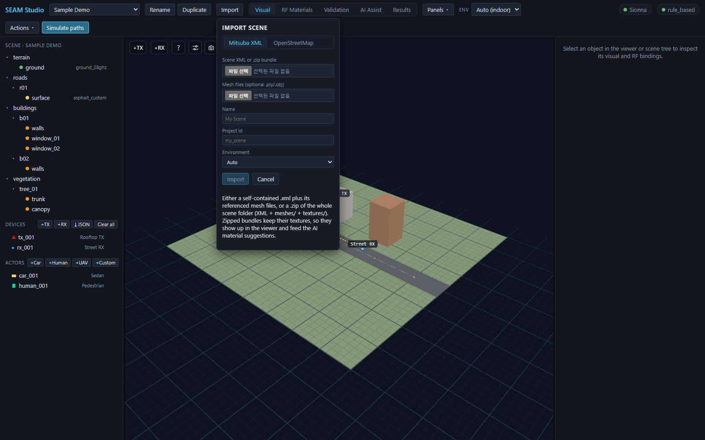
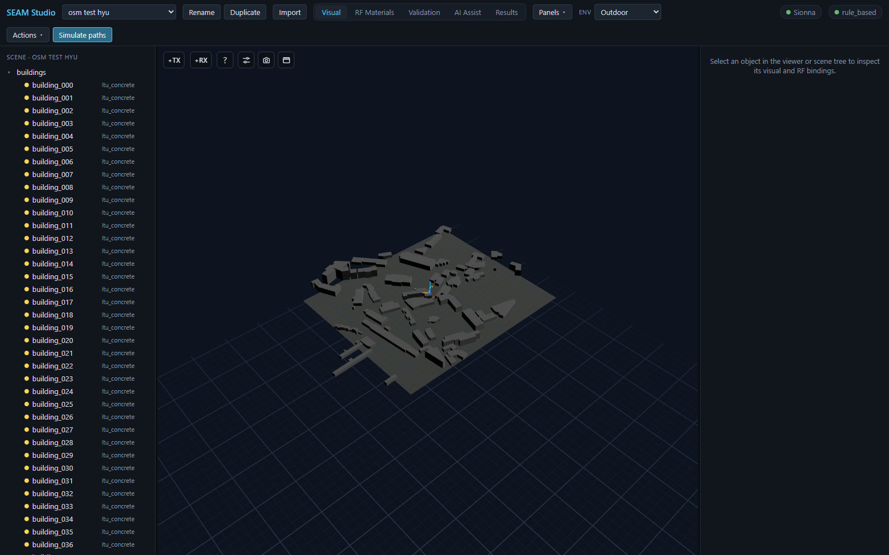
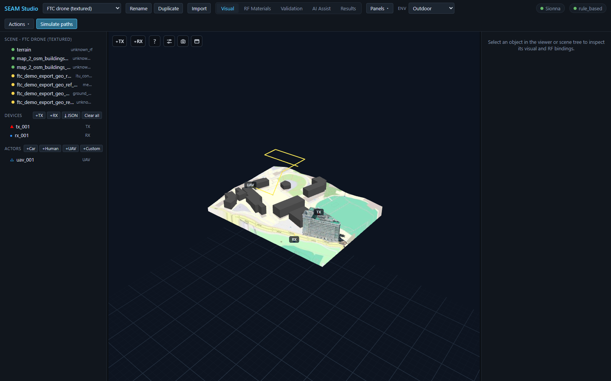

# Importing Scenes: Mitsuba XML, OpenStreetMap, and Device JSON

> **English** · [한국어](scene_import.ko.md)

SEAM Studio gets geometry into a project three ways: a **Mitsuba/Sionna XML
scene** (a single `.xml` plus mesh files, or a `.zip` of the whole scene
folder), an **OpenStreetMap area** (real-world buildings extruded to 3D), and —
for radio devices and UE routes rather than geometry — **JSON point import**.
This guide walks through all three. Everything here works with the Mock
backend, so you don't need Sionna RT installed to follow along.

| You have | Use | You get |
|---|---|---|
| A Mitsuba/Sionna scene (`.xml` + meshes, or a `.zip`) | **`Import`** → **`Mitsuba XML`** | the scene as a new project; textures kept if zipped |
| A real-world address or area | **`Import`** → **`OpenStreetMap`** | extruded buildings with default RF materials |
| TX/RX positions or a UE route in JSON | **`⤓ JSON`** (Devices) / **`⤓ Import JSON`** (trajectory) | devices/waypoints added to the open project |

---

## 1. The Import button and the Import scene dialog

Press **`Import`** on the left of the top toolbar (next to the project select).
A small **Import scene** dialog opens with two source tabs: **`Mitsuba XML`**
and **`OpenStreetMap`**. If you have no projects at all yet, the empty state
shows an **`Import a scene`** button that opens the same dialog.

*The Import scene dialog — Mitsuba XML tab active, OpenStreetMap next to it.*

Whichever tab you use, the bottom three fields are the same:

- **Name** — display name shown in the project select (e.g. `My Scene`).
- **Project id** — folder-safe id, auto-derived from the name until you edit
  it. Lowercase letters, digits, `-` and `_` only; a duplicate id is rejected
  inline.
- **Environment** — `Auto`, `Indoor`, or `Outdoor` (see
  [section 4](#4-environment-modes-auto--indoor--outdoor)).

The primary **Import** button starts the import; **Cancel** closes the dialog.

## 2. Mitsuba XML tab

The **`Mitsuba XML`** tab imports a Mitsuba/Sionna RT scene as a new project.
You have two options in the **Scene XML or .zip bundle** file picker:

1. **A single `.xml` file.** If the XML references external meshes, add them
   through the second picker, **Mesh files (optional .ply/.obj)** (multiple
   selection; `.ply`, `.obj`, `.stl`).
2. **A `.zip` of the whole scene folder** — the XML plus its `meshes/` and
   `textures/` directories at their original relative paths. When you pick a
   zip, the mesh picker disappears: the bundle already carries everything.

Prefer the zip when the scene has textures. As the dialog's own hint puts it:
zipped bundles keep their textures, so they show up in the viewer **and feed
the AI material suggestions** — a vision-capable provider in the **AI Assist**
tab can look at the actual surface photos when proposing RF materials, instead
of guessing from mesh names alone.

Steps:

1. Press **`Import`** in the toolbar and stay on the **`Mitsuba XML`** tab.
2. Pick your `.xml` or `.zip` in **Scene XML or .zip bundle**. The **Name**
   field auto-fills from the file name.
3. (Single-XML only) add companion meshes under **Mesh files (optional
   .ply/.obj)**.
4. Check **Name**, **Project id**, and **Environment**, then press **Import**.
5. The import runs as a background job — a progress row (`Importing…` with the
   current phase and step count) tracks it, and you can keep working. When it
   finishes, the new project opens automatically; non-fatal warnings (skipped
   meshes, remapped materials) surface as a notification.

## 3. OpenStreetMap tab

The **`OpenStreetMap`** tab builds an outdoor scene from real-world building
footprints. It needs internet access (it queries the OSM Overpass API).

1. Switch the dialog to **`OpenStreetMap`**. The dialog widens to show a map
   with a search box (**Search a place…**) — type a place name or paste any
   coordinate from Google Maps.
2. Press **`▭ Select area on map`**, then drag a rectangle on the map (the
   button switches to `Drag a rectangle on the map…` while armed). The
   **Latitude**, **Longitude**, **Width (m, E–W)**, and **Height (m, N–S)**
   fields fill in automatically; you can also type them directly. Area sides
   are clamped to 50–3000 m.
3. Set **Default bldg height (m)** — used for buildings whose OSM data has no
   height or level tags (minimum 3 m).
4. Fill in **Name** / **Project id**, then press **Import** (it reads
   `Fetching OSM…` while running).

The importer fetches every building footprint inside the rectangle, extrudes
each one using its OSM `height`/`levels` tags (falling back to your default
height), and drops a ground plane. Every prim arrives with an RF material
already bound: buildings get **`itu_concrete`** and the ground gets
**`ground_28ghz`** (a 28 GHz-safe ground). The scene also stores the geodetic
anchor of your rectangle's center, which later lets you import devices and
waypoints by latitude/longitude (see section 5).

*An imported OSM area — extruded buildings, all `itu_concrete`, ENV Outdoor.*

`itu_concrete` everywhere is a deliberate starting point, not the final
answer. Refine it afterwards in the **RF Materials** tab (per-object or
bulk assignment) or let the **AI Assist** tab propose better candidates with
**Suggest RF materials** — see [RF materials](../rf_materials.md) and the
[AI assistant](../ai_assistant.md).

## 4. Environment modes (Auto / Indoor / Outdoor)

The **Environment** field in the import dialog — and the **`Env`** select in
the toolbar afterwards — tells SEAM Studio what scale of scene it is dealing
with:

- **Auto** infers indoor/outdoor from the scene's spatial extent (a largest
  span under 25 m reads as indoor); the toolbar shows what it resolved to,
  e.g. `Auto (outdoor)`.
- **Indoor** applies compact solver defaults: path depth 5 with refraction on,
  and a fine 0.25 m radio-map grid at 1.2 m height.
- **Outdoor** applies wide-area defaults: path depth 3, refraction off, and a
  2 m radio-map grid at 1.5 m height.

The environment also drives viewer sizing — device markers get a larger
minimum size outdoors so they stay visible on a campus-scale scene, and path
interaction dots shrink indoors — plus a wider default camera framing for
outdoor scenes. Changing **`Env`** later applies the matching solver defaults
to the Paths/Radio map sections for the session (your hand-tuned knobs are
only overwritten when you actually switch environments, and nothing is saved
as the project default unless you save it explicitly).

## 5. Importing devices and trajectories from JSON

Scene import brings geometry; radio devices and UE routes have their own JSON
import that works on any open project:

- **Devices** — in the scene tree's **Devices** section header, next to
  **`+TX`** / **`+RX`**, press **`⤓ JSON`** and pick a JSON file. Devices are
  upserted into the scene (existing ids are updated in place), and a
  notification reports how many were added/updated plus any warnings.
- **Trajectory waypoints** — in the trajectory routes editor of the
  **Results** mode, **`⤓ Import JSON`** loads a UE route from a file, as an
  alternative to drawing it in the viewport.

Both accept the same point schema: **cartesian** points (`x`/`y`/`z`, local
ENU meters, Z-up) or **geographic** points (`lat`/`lon` with `alt_m` or
`agl_m`), auto-detected per entry and freely mixed in one file. Geographic
points require the scene to have a geodetic anchor — OSM imports set one
automatically. The full format, including `agl_m` height-above-ground
semantics, orientation fields, and ready-made templates, is in
[Point / device / trajectory import](../point_import.md).

## 6. What a drone-scan textured bundle looks like

The bundled **FTC Outdoor** example shows where a zipped, textured import can
end up: a photogrammetry (drone-scan) building whose photo textures render
directly in the viewer, surrounded by OSM-imported context buildings and
terrain, with a UAV actor following a yellow flight path above the site.

*The FTC Outdoor scene — a photo-textured drone-scan building plus OSM context, with a UAV flight path.*

Because the textures survive the import, this kind of scene gets the full
pipeline: the **AI Assist** tab can reason about the visible surfaces
(concrete/glass/metal splits), and everything downstream — paths, radio maps,
trajectories — runs on the same geometry. Open the `FTC Outdoor` project from
the toolbar's project select to explore one without importing anything.

## Troubleshooting

- **A duplicate Project id** is rejected inline (`a project "…" already
  exists`) — pick another id before the Import button enables.
- **OpenStreetMap import fails or hangs** — the Overpass API needs internet
  and can time out on very large rectangles; the error appears inside the
  dialog. Retry, or shrink the selected area.
- **Closing the dialog mid-import** (XML tab) stops the progress display, but
  the job itself keeps running server-side — the project appears in the
  project select once it finishes.

---

## Related docs

- [Point / device / trajectory import](../point_import.md) — the JSON format for section 5
- [RF materials](../rf_materials.md) — refining the default `itu_concrete` assignments
- [AI assistant](../ai_assistant.md) — texture-aware material suggestions
- [Scene format](../scene_format.md) — what an imported project looks like on disk
- [15-minute tutorial](../../TUTORIAL.md) — the full first-session loop
