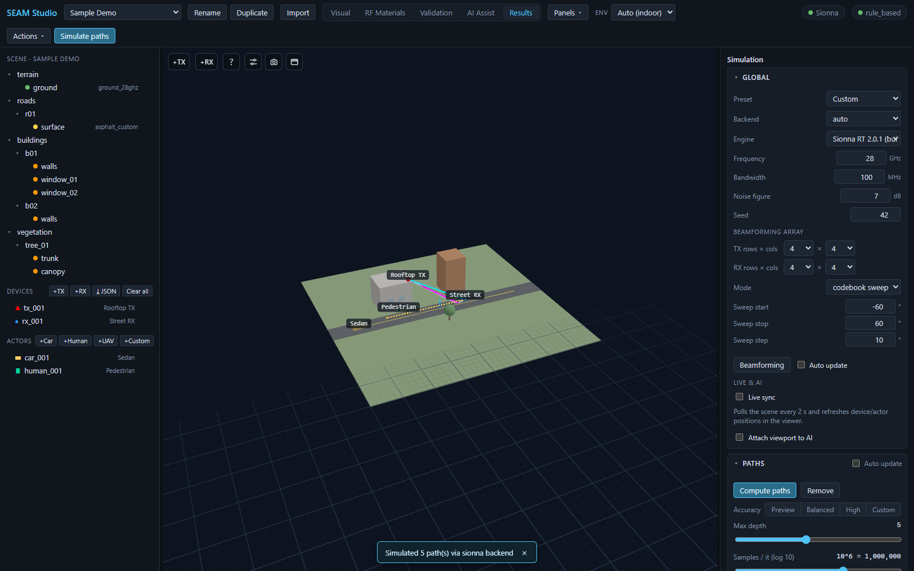
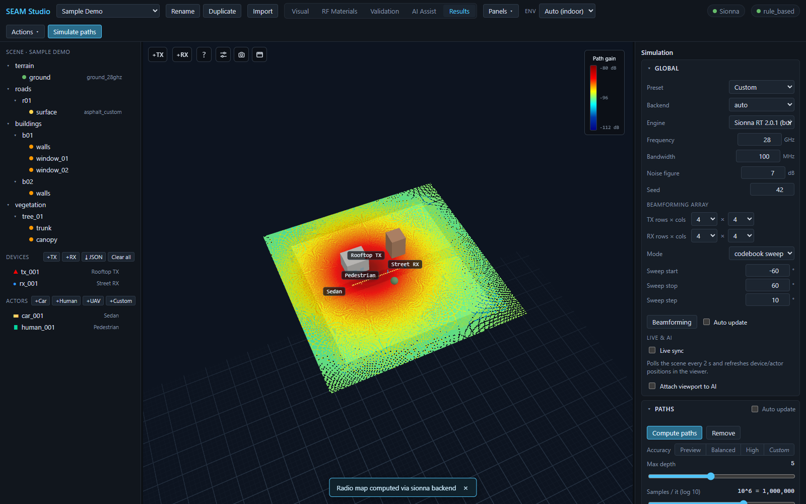
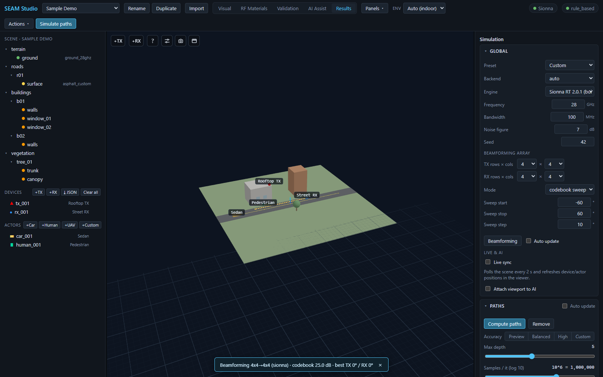
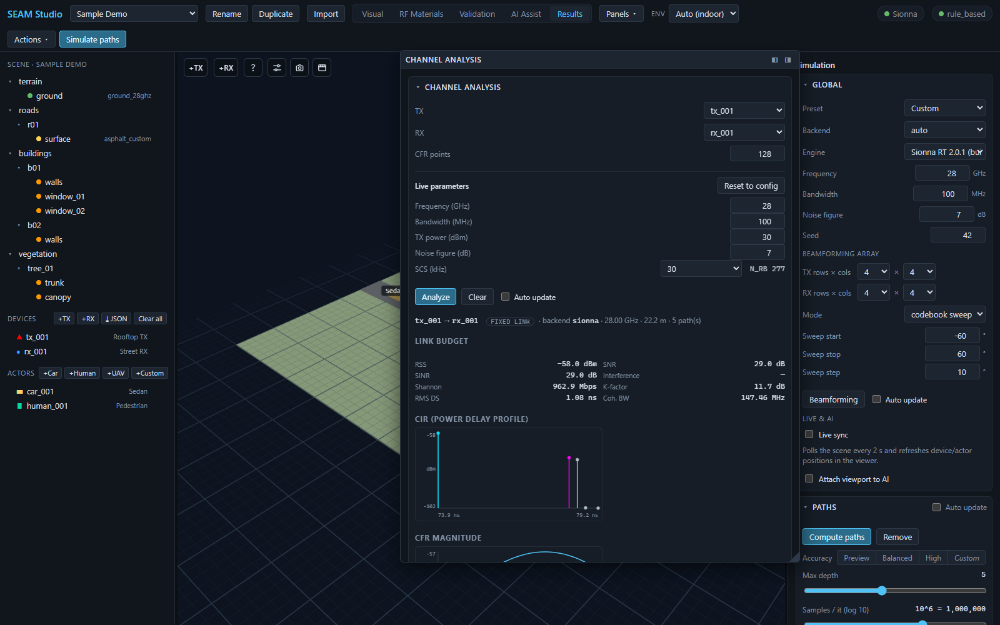

# Simulating: paths, radio maps, beamforming, and channel analysis

> **English** · [한국어](simulation.ko.md)

Everything you compute in SEAM Studio happens in **Results** mode: ray paths,
coverage radio maps, MIMO beamforming, and per-link channel analysis. This
guide walks through each solver, the knobs that matter, and how to read the
results. The whole workflow runs on the **Mock backend** if Sionna RT is not
installed, so you can follow along without a GPU.

---

## 1. Results mode layout

Click the **Results** tab in the toolbar. The right sidebar holds the
**Simulation** panel with three collapsible sections — **Global**, **Paths**,
and **Radio map** — plus the **Results** panel (path table, overlay toggles).
The **Channel analysis**, **Metrics dashboard**, **UE trajectory**,
**Scenario playback**, and **ML dataset** panels are dockable: open the
**Panels ▾** menu in the toolbar to float any of them or dock them to either
sidebar, from any mode.

The **Global** section is the shared solver configuration — every solver
(paths, radio map, beamforming, channel) reads it:

| Field | What it does |
|---|---|
| **Preset** | Applies a canonical solver configuration to both Paths and Radio map: `28 GHz Indoor Lab`, `28 GHz Outdoor Campus`, `3.5 GHz Urban Macro`, `60 GHz Indoor`, `28 GHz UAV A2G`. Editing any knob by hand flips it to `Custom`. |
| **Backend** | `auto` / `mock` / `sionna`. `auto` uses Sionna RT when installed and falls back to the mock solver otherwise. |
| **Engine** | Only shown when more than one Sionna RT version is registered — pick which version solves paths (e.g. `Sionna RT 2.0.1`). See [../engines.md](../engines.md). |
| **Frequency** (GHz) | Carrier frequency (default 28 GHz). |
| **Bandwidth** (MHz) | Channel bandwidth used for noise, CFR, and capacity. |
| **Noise figure** (dB) | Receiver noise figure for SNR/SINR. |
| **Seed** | Random seed — same seed, same rays. |

The Global section also hosts the **Beamforming array** settings (section 4)
and the **Live sync** toggle.

---

## 2. Paths

*A paths solve: TX→RX polylines colored by interaction type, with the Simulation panel's Global and Paths sections.*

There are two buttons that run the same solve:

- the blue **Simulate paths** button on the right of the toolbar (one-click,
  available in any mode), and
- **Compute paths** inside the **Paths** section of the Simulation panel
  (next to all the knobs, when you want to tune first).

1. Press either button. A toast reports the outcome, e.g.
   `Simulated 5 path(s) via sionna backend`.
2. Rays overlay the 3D scene as TX→RX polylines, colored by interaction:
   **LOS cyan, reflection magenta, diffraction orange, scattering green**.
   TX markers are red, RX markers blue.
3. The **Results** panel lists every path (**type / dBm / ns / #int**
   columns). Click a row to see its vertices and interactions mapped to prim
   ids and RF materials, plus a **Delay vs power** scatter and an
   **AoA / AoD** plot.

### Accuracy presets

Instead of tuning ray counts by hand, use the **Accuracy** segmented control
in the Paths section:

| Preset | Samples/it | Max depth |
|---|---|---|
| **Preview** | 10^5 | 2 |
| **Balanced** | 10^6 | 3 |
| **High** | 5×10^6 | 5 |

Move the **Max depth** (0–12) or **Samples / it (log 10)** (10^4–10^7)
sliders yourself and the control shows **Custom**. Below them, mechanism
checkboxes (**Line of sight**, **Specular reflection**, **Diffuse
reflection**, **Refraction**, **Diffraction**, **Edge diffraction**,
**Lit-region diffraction**) pick which interactions the solver traces.

### Overlay toggles and filters

The **Show:** row in the Results panel toggles each overlay independently —
**Rays**, **Radio map**, **Beamforming**, **Trajectory rays**, **Scenario**.
The viewer controls filter what is drawn: **Strongest N** (or **All**),
**Min power** (dBm), **Color by** `type`/`power`/`depth`, and **Line width by
power**. To clear the ray overlay entirely, press **Remove** in the Paths
section. Keep **Auto update** checked and the paths re-solve automatically
whenever the scene changes.

---

## 3. Radio map

*A radio map draped over the scene: jet colormap, the "Path gain" dB colorbar, and the completion toast.*

A radio map sweeps a receive grid over the scene and paints received strength
as a heatmap:

1. In the **Radio map** section of the Simulation panel, press
   **Compute radio map** (or **Simulate radio map** in the Results panel).
2. The heatmap appears with a **jet** colormap (blue = weak, red = strong),
   and a colorbar legend labeled **Path gain** (dB) — or **RSS** (dBm) —
   shows the value range in the viewport.
3. Options: **Cell size** (m), **Height** (m), and **Metric** —
   `Path gain (dB)`, `RSS (dBm)`, or `SINR (multi-TX)`. The section has its
   own **Accuracy** / **Max depth** / **Samples** / mechanism knobs.
4. **Remove** clears the overlay. **Auto update** recomputes on scene edits,
   and the **every** select (10 s / 30 s / 1 min / 5 min) re-solves on a
   fixed period for live-sensing scenes.

### Cell map vs mesh map

The map above is a **planar cell map** — a horizontal grid at a fixed height.
To paint coverage **onto actual surfaces** (walls, floors, roads), select the
target prims, open the **Mesh radio map** collapsible in the Results panel,
and press **Run mesh radio map**. It solves one probe per triangle and drapes
the color over the geometry; its own **Mesh map** checkbox toggles the
overlay, and the value range is reported as e.g. `Path gain range −95.2 … −61.4 dB (jet: low → high)`.

---

## 4. Beamforming array

*A codebook sweep result: array setup in the Global section and the summary toast.*

1. In the **Global** section, set the **Beamforming array**:
   **TX rows × cols** and **RX rows × cols** (1/2/4/8 each, e.g. 4 × 4).
2. Pick a **Mode**:
   - **codebook sweep** — sweeps beam angles on both ends; reveals the
     **Sweep start / Sweep stop / Sweep step** (°) fields.
   - **TX-MRT** — maximum-ratio transmission at the TX.
   - **SVD** — both-ends SVD beamforming.
3. Press the **Beamforming** button (also available in the Results panel and
   via toolbar **Actions ▾ → Beamforming**).
4. The toast summarizes the run, e.g.
   `Beamforming 4x4→4x4 (mock) · codebook 25.0 dB · best TX 0° / RX 0°`,
   and a result card shows the single-element reference, the gain, and — for
   a codebook sweep — a jet heatmap of gain vs TX/RX angle. The **Auto
   update** checkbox next to the button re-runs it on scene changes.

---

## 5. Channel analysis

*The Channel analysis panel floated over the viewport: link budget, CIR power-delay profile, and CFR magnitude.*

The **Channel analysis** panel is dockable — reach it from **Panels ▾** and
float it if you want it side by side with the 3D view.

1. Pick the **TX** and **RX** devices and set **CFR points** (frequency
   samples across the band, default 128).
2. Adjust **Live parameters** if needed: **Frequency (GHz)**,
   **Bandwidth (MHz)**, **TX power (dBm)**, **Noise figure (dB)**, and
   **SCS (kHz)** (15/30/60/120). Next to SCS the derived **N_RB** (resource
   blocks = ⌊BW/(12·SCS)⌋) updates live; **Reset to config** restores the
   values from the solver config and TX device.
3. Press **Analyze**. The result line shows the pair with a **fixed link**
   badge (a snapshot at the current positions — moving-receiver sweeps live
   in the UE trajectory panel), the backend, frequency, 3D distance, and
   path count.

Below it:

- **Link budget** — **RSS**, **SNR**, **SINR**, **Interference** (with the
  interfering-TX count in multi-TX scenes), **Shannon** capacity,
  **K-factor**, **RMS DS** (delay spread), **Coh. BW**, and, when the channel
  is time-varying, **Doppler spread** and **Coh. time**.
- **CIR (power delay profile)** — one stem per tap, colored by path type.
- **CFR magnitude** — |H| in dB across the band.
- **Path-loss models vs RT** — 3GPP model predictions with their delta
  against the ray-traced reference.

Once you change a Live parameter after an analysis, the panel re-analyzes the
same pair automatically (debounced). The **Auto update** checkbox re-runs the
last analysis whenever the scene changes (it needs one manual **Analyze**
first); **Clear** discards the result.

Three collapsed sections extend the panel: **Channel sweep** (chart a link
metric against a swept config field via **Run sweep**), **Doppler-time
spectrogram** (**Compute spectrogram** — an STFT heatmap of the time-varying
channel), and **Flight-log validation** (**Validate** measured vs predicted
path gain along a route).

---

## 6. Backends, persistence, and stale results

- **Every solver falls back to the Mock backend** when Sionna RT is not
  installed (the toolbar chip reads **Mock only**). The mock is deterministic
  and shape-compatible, so you can build and test full workflows on any
  laptop, then flip **Backend** to `sionna` on a real machine.
- Results persist per project: paths land in
  `results/{backend}_paths_{NNN}.json` under the project folder, and the
  latest of each kind reloads with the project.
- The **Run history** collapsible in the Results panel is the results
  explorer: past runs grouped by kind, reloadable with one click, labelable,
  and prunable (**Keep latest** N per kind → **Prune old results**; labeled
  runs are spared).
- Whenever the scene changes after a compute, the result grows a **⚠ stale**
  badge — the numbers are never silently outdated; re-run to refresh.

---

## Related docs

- [Getting started guide](getting_started.md) — install, first project, modes tour
- [TUTORIAL](../../TUTORIAL.md) — the full 15-minute first session
- [Engines](../engines.md) — solving paths on alternate Sionna RT versions
- [Sionna versions](../sionna_versions.md) — feature/material evolution per version
- [Accuracy](../accuracy.md) — RT accuracy limits and measurement calibration
- [ML datasets](../ml_datasets.md) — turning solves into training data
