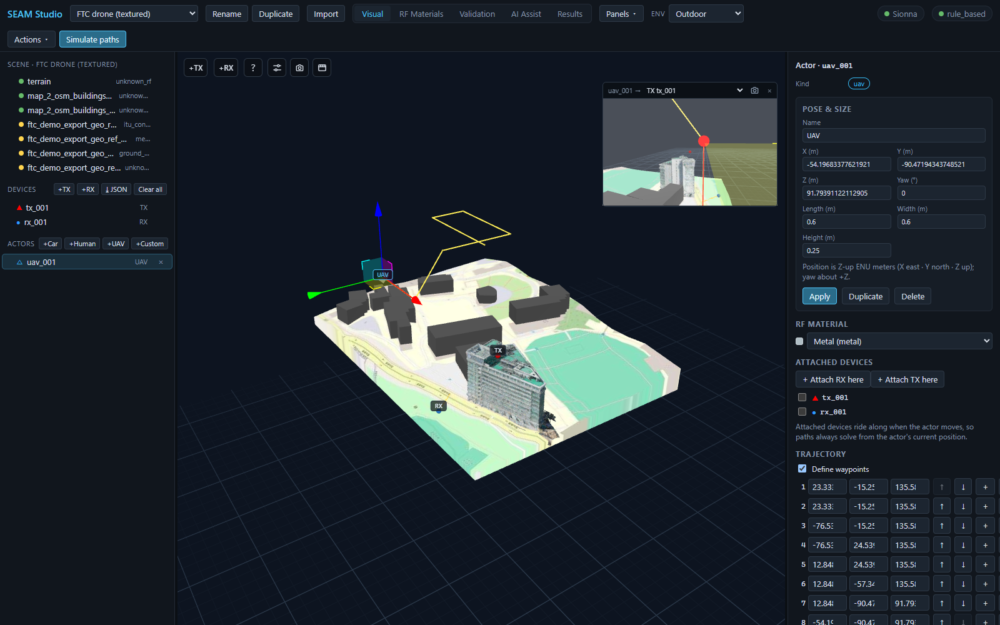
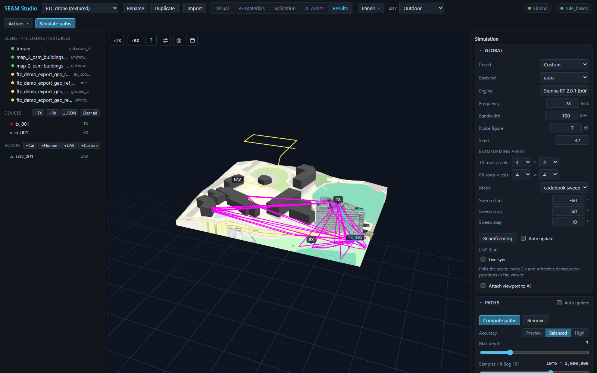
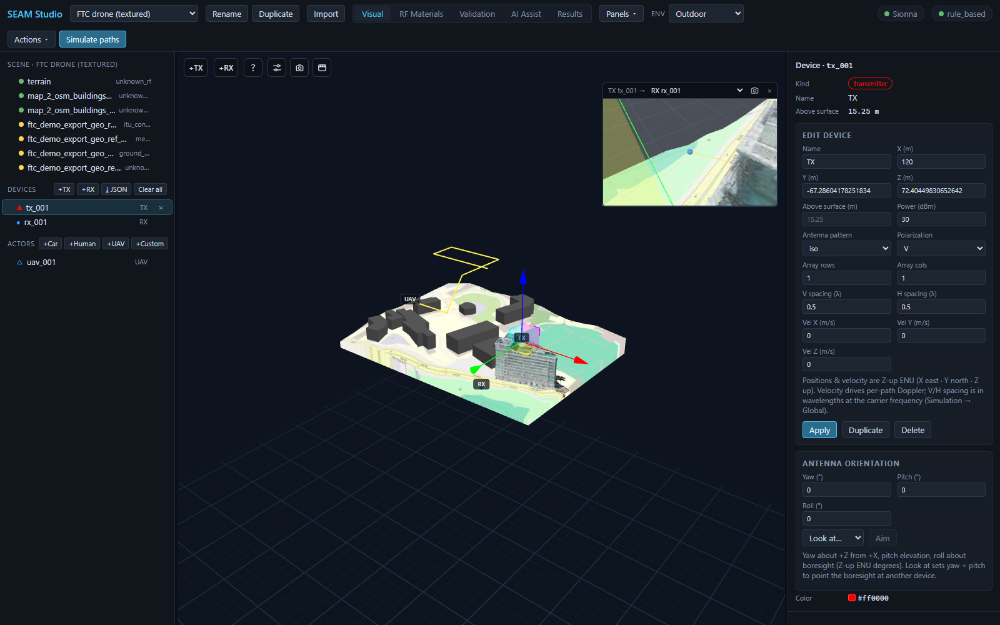

# 궤적과 UAV: 이동 수신기, 재생, POV 뷰

> [English](trajectory_uav.md) · **한국어**

정적 TX→RX 솔브가 한 순간의 스냅샷이라면, **궤적(trajectory)** 은 수신기가
씬을 날거나 달리거나 걸어가는 동안 링크가 어떻게 변하는지를 보여줍니다. 이
가이드에서는 UE를 움직이는 두 가지 방법, 안테나를 부착한 UAV 액터, 뷰어의
궤적 재생 동작 규칙(정확한 의미), 그리고 엔티티별 POV 인셋을 다룹니다. 전
과정이 Mock 백엔드만으로 동작하므로 GPU/Sionna RT 없이 그대로 따라 할 수
있습니다.

---

## 1. UE를 움직이는 두 가지 방법

| 방식 | 위치 | 무엇이 움직이나 |
|---|---|---|
| **디바이스 궤적** | **Results** 모드 → **UE trajectory** 패널 | 기존 RX 디바이스가 start→end 직선 또는 그린 웨이포인트를 따라 이동하며 스텝마다 한 번씩 솔브. |
| **액터 비행 경로** | 액터 선택 → 인스펙터 **TRAJECTORY** 섹션 | 액터(예: UAV)가 자신의 웨이포인트를 따라 비행하고, **부착된 RX**가 함께 이동하며 경로를 날아갑니다. |

두 방식 모두 같은 궤적 엔진으로 들어갑니다. 결과는 스텝별 샘플 시계열
(**RSS / path gain / SINR / RMS delay spread / 경로 수**)과 스텝별 라이브
레이이며, 뷰어에서 재생할 수 있습니다.

---

## 2. 디바이스 궤적 — UE trajectory 패널

1. **Results** 모드로 전환해 **UE trajectory** 패널을 찾습니다(다른 패널처럼
   도킹 가능 — ◧/◨/⧉ 로 이동).
2. 경로를 정의합니다. 세 가지 방법:
   - **`⌖ Pick start → end in viewport`** — 3D 뷰에서 두 점을 클릭합니다.
     첫 클릭이 start, 둘째 클릭이 end(Esc 취소)이고, 점선 노란 미리보기
     선이 구간을 보여줍니다. **Start at RX** 를 누르면 현재 첫 RX 위치로
     **Start** / **End** 필드를 채워 줍니다.
   - **Draw route (Esc finishes)** — 3D 뷰에서 웨이포인트를 하나씩 클릭하고
     Esc 로 마칩니다(2점 이상). 씬에 RX가 여러 개면 셀렉터로 그린 경로가
     어느 RX 것인지 고를 수 있어, UE마다 경로를 하나씩 만들어 모두 함께
     움직이게 할 수 있습니다.
   - **`⤓ Import JSON`** — JSON 파일에서 웨이포인트를 불러옵니다. 직교
     `x/y/z` 와 지리 `lat/lon` 좌표를 자동 감지하고(지리 좌표는 씬의 측지
     앵커 필요), 지하로 들어간 점은 경로 행에 ⚠ 경고로 표시됩니다.
     웨이포인트별 안테나 방향이 있는 파일은 *oriented* 칩이 붙습니다. 포맷
     상세: [../point_import.ko.md](../point_import.ko.md).
3. (선택, 실외) **Follow terrain** 을 켜면 각 웨이포인트가 그 아래 지형
   표면에 드레이프된 뒤 **UE height** 오프셋만큼 올라갑니다 — 경사진 지면
   위에서 UE 높이를 일정하게 유지합니다. 실내에서는 끄세요.
4. **Num points**(솔브 스텝 수, 2–200; 모든 경로가 이 스텝 수로 리샘플링됨)와
   **dt**(스텝당 초)를 설정합니다.
5. **Simulate trajectory** 를 누릅니다. 스텝마다 이동한 위치에서 TX→RX 전체
   솔브가 한 번씩 실행되고, TX가 여러 개면 스텝별 **SINR**·간섭도 함께
   나옵니다. 여러 UE에 경로를 준 경우 **Include fixed UEs** 를 켜면 경로가
   없는 RX도 매 스텝 고정 위치에서 함께 솔브됩니다.

결과 줄에는 UE id, *moving UE* 칩, 샘플 수와 백엔드, 그리고 마커/트레일/레이
오버레이를 즉시 지우는 **✕ Remove** 버튼이 표시됩니다.

---

## 3. UAV 액터

### 생성과 포즈

씬 트리의 **ACTORS** 줄에서 **+UAV** 를 누릅니다(**+Car**, **+Human**,
**+Custom** 옆). UAV는 씬 중심 상공에 떠 있는 상태로 생성됩니다. 선택하면
인스펙터에 **Actor · `<id>`** 와 함께 **POSE & SIZE** 섹션이 나타납니다:
**Name**, **X / Y / Z (m)**, **Yaw (°)**, **Length / Width / Height (m)**,
그리고 **Apply**. 위치는 **Z-up ENU 미터**(X 동 · Y 북 · Z 상)이고 yaw는 +Z
축 기준 회전입니다. 뷰포트 기즈모로 드래그해 옮길 수도 있습니다.

UAV는 절차적 쿼드로터 모델(동체, 로터 암 4개, 스키드, 짐벌 카메라)로
렌더링됩니다. 넓은 실외 씬에서는 *시각* 모델이 디바이스 마커 수준의
가시성으로 확대됩니다 — 실제 0.6 m 드론은 캠퍼스 스케일에서 화소보다 작아
보이지 않기 때문입니다. RF 프로젝션은 실제 `size_m` 박스를 그대로 씁니다.

*선택된 `uav_001` — 뷰포트의 기즈모와 노란 비행 경로, 라이브 POV 인셋(uav_001 → TX tx_001), `+ Attach RX here` / `+ Attach TX here` 버튼과 웨이포인트 표가 있는 액터 인스펙터.*

### 부착 디바이스 — 액터가 RF 엔드포인트가 되는 법

액터는 산란체일 뿐이고, **레이는 안테나에서 끝납니다**. UAV를 RF
엔드포인트로 만들려면 **ATTACHED DEVICES** 섹션에서 **`+ Attach RX here`**
를 누르세요(UAV 릴레이/기지국이라면 **`+ Attach TX here`**). 액터 위에
안테나가 생성되고 부착 디바이스 목록에 체크됩니다. 부착된 디바이스는 **액터가
움직일 때 함께 이동**하므로, 경로 솔브는 항상 액터의 현재 위치에서
계산됩니다.

### 비행 경로 — TRAJECTORY 섹션

**TRAJECTORY** 섹션의 **Define waypoints** 를 체크하면 액터에 비행 경로가
생깁니다. 각 웨이포인트 행에는:

- 행 번호(클릭하면 그 웨이포인트가 3D 뷰에서 강조),
- 편집 가능한 **X / Y / Z** 필드,
- **↑ / ↓** — 순서 바꾸기(이전/다음 웨이포인트와 교환),
- **+** — 이 행 뒤에 웨이포인트 삽입(다음 점과의 중간점; 마지막 행 뒤는
  X 방향 +2 m),
- **×** — 삭제(웨이포인트가 2개일 때는 차단 — 궤적에는 최소 한 구간이
  필요하므로, 경로 전체를 없애려면 **Define waypoints** 체크를 해제하세요).

표 아래의 **+ Waypoint** 는 액터의 현재 위치를 추가하고, **⌖ Pick
waypoint** 는 뷰포트에서 클릭한 점을 추가하며, **Record current pos** 는 방금
드래그해 놓은 포즈를 기록합니다. **dt**(s)와 **Mode**(`once` / `loop` /
`pingpong`)가 애니메이션을 제어하고, 재생은 **Results → Scenario playback**
에서 합니다(`Simulate scenario` 가 모든 액터를 각자의 웨이포인트를 따라
움직입니다).

### ⚡ Simulate paths along trajectory

**`⚡ Simulate paths along trajectory`** 버튼(웨이포인트 2개 이상 *그리고*
부착된 RX가 있어야 활성화)은 액터의 웨이포인트를 궤적 엔진으로 바로
보냅니다: **비행 경로의 각 스텝에서 TX→RX 솔브를 한 번씩, 스텝별 레이와
함께** 실행합니다. 경로를 실제로 나는 것은 부착된 RX입니다 — RX가 없으면
버튼 툴팁이 먼저 RX를 부착하라고 알려줍니다. 결과는 디바이스 궤적과 똑같이
**UE trajectory** 패널에 나타납니다.

---

## 4. 궤적 재생 — 정확한 동작 규칙

궤적 결과가 생기면 **UE trajectory** 패널 아래에 재생 트랜스포트가
붙습니다: **▶ / ⏸**, `현재/전체` 카운터가 달린 프레임 슬라이더, **⟳** 반복,
속도 셀렉트(0.5×–4×). 다중 UE 실행에서는 UE별 스크럽 바와 **KPI UE**
셀렉터가 추가됩니다. 뷰어의 동작은 의도적으로 엄격합니다:

- **궤적을 실행하면 재생이 활성화(engage)됩니다.** 새로 **Simulate
  trajectory** 를 누르면(액터의 ⚡ 버튼도 동일) **Trajectory rays** 오버레이
  토글이 켜지고, **움직이는 UE 마커**(씬 스케일, 정적 디바이스 마커보다
  약간 작음)와 해당 스텝의 레이가 표시됩니다. 슬라이더를 스크럽하거나 ▶ 를
  누르면 마커가 움직이며 프레임별 레이가 다시 그려집니다.
- **정적 디바이스 마커는 항상 씬 위치에 그대로 있습니다.** 움직이는 마커는
  *오버레이*일 뿐, RX 디바이스 자체는 절대 순간이동하지 않고 정적 마커도
  숨겨지지 않습니다.
- **`Simulate paths` 를 누르면 재생이 완전히 해제(disengage)됩니다.** 뷰어가
  새 정적 경로 결과로 전환되면서 **Trajectory rays** 토글이 꺼지고, 재생이
  멈추고, 프레임(과 UE별 스크럽)이 0으로 리셋됩니다 — 움직이는 마커는 새
  레이 옆에 "옮겨진 RX"처럼 남지 않고 사라집니다. 이후에도 두 오버레이는
  각각 독립적으로 다시 켤 수 있습니다.
- **프로젝트를 다시 열면 해제된 상태로 도착합니다.** 저장된 궤적 결과가
  자동 로드되어 트랜스포트와 차트는 준비되지만, **Trajectory rays** 토글은
  꺼진 채 시작합니다 — ▶ 를 누르거나 스크럽하거나 토글을 다시 켜기 전에는
  마커가 나타나지 않습니다.

*비행 중간에 재생이 활성화된 모습 — 프레임별 레이가 움직이는 `rx_001` 마커로 수렴하고, 정적 TX/RX 마커는 씬 위치에 정확히 그대로 있습니다.*

---

## 5. 엔티티 POV 인셋

**TX**, **RX**, 액터 중 아무거나 클릭하면 뷰포트 우상단에 라이브 인셋이
열립니다: **그 엔티티가 링크 상대를 바라보는 시점**을 렌더링합니다. 헤더는
예를 들어 **`TX tx_001 →`** 뒤에 상대 셀렉터가 붙는 형태입니다(TX는 기본으로
첫 RX를, 나머지는 첫 TX를 바라봅니다). 궤적·시나리오 재생 중에는 인셋이
실시간 렌더 포즈를 따라갑니다. POV 패스에서는 소스 자신의 기체가 숨겨지므로
UAV 카메라가 자기 로터에 가리지 않습니다. 카메라 버튼은 POV 뷰를 전체 해상도
PNG로 저장하고, **×** 는 인셋을 닫습니다(다음 선택 때 다시 열립니다).

*`tx_001` 을 선택하면 인셋이 초록 LOS 레이를 따라 TX tx_001 → RX rx_001 시점을 보여줍니다. 인스펙터의 ANTENNA ORIENTATION 섹션(Yaw / Pitch / Roll, `Look at…`, `Aim`)으로 보어사이트를 다른 디바이스로 향하게 할 수 있습니다.*

관련: 디바이스 인스펙터의 **ANTENNA ORIENTATION** 섹션에서 **Yaw (°) /
Pitch (°) / Roll (°)** 을 직접 입력하거나, **Look at…** 에서 대상을 고르고
**Aim** 을 누르면 보어사이트가 그 대상을 향합니다 — 방금 날린 UAV를 향해
지향성 TX를 조준할 때 편리합니다.

---

## 6. 숫자는 어디로 가나

재생 줄에는 프레임별 KPI(t, 위치, **RSS**, **Path gain**, **SINR**/**SNR**,
**RMS delay**, **Paths**)가 표시됩니다. 전체 시계열은 **Metrics dashboard**
패널에서 봅니다: 궤적 결과가 생기면 논문 스타일 차트 — *Trajectory: power vs
time*(RSS/SINR, 파생 RSRP), *RMS delay spread vs time*, *path count vs
time*, 그리고 가능한 경우 도플러·서빙 셀/핸드오버 뷰 — 가 추가되며, 각각
PNG/SVG/CSV 내보내기를 지원합니다. 궤적 샘플은 ML 데이터셋(`trajectory`
샘플링 모드, [../ml_datasets.ko.md](../ml_datasets.ko.md) 참고)과 RFData
내보내기(`trajectory.csv`)에도 들어갑니다.

---

## 관련 문서

- [simulation.ko.md](simulation.ko.md) — 이 가이드의 바탕이 되는 정적 솔브(경로, 라디오맵, 채널 분석)
- [../point_import.ko.md](../point_import.ko.md) — JSON 웨이포인트/디바이스 임포트 포맷(직교·지리 좌표)
- [../../TUTORIAL.ko.md](../../TUTORIAL.ko.md) — 15분 첫 세션(간단한 궤적 실행 포함)
- [datasets_export.ko.md](datasets_export.ko.md) — ML 데이터셋(trajectory 샘플링 모드)과 RFData 내보내기
- [../dynamic_scattering.ko.md](../dynamic_scattering.ko.md) — 움직이는 액터가 RF 지오메트리로 컴파일되는 방식
- [materials_and_ai.ko.md](materials_and_ai.ko.md) — RF 재질 지정(액터에도 RF 재질이 있습니다)
